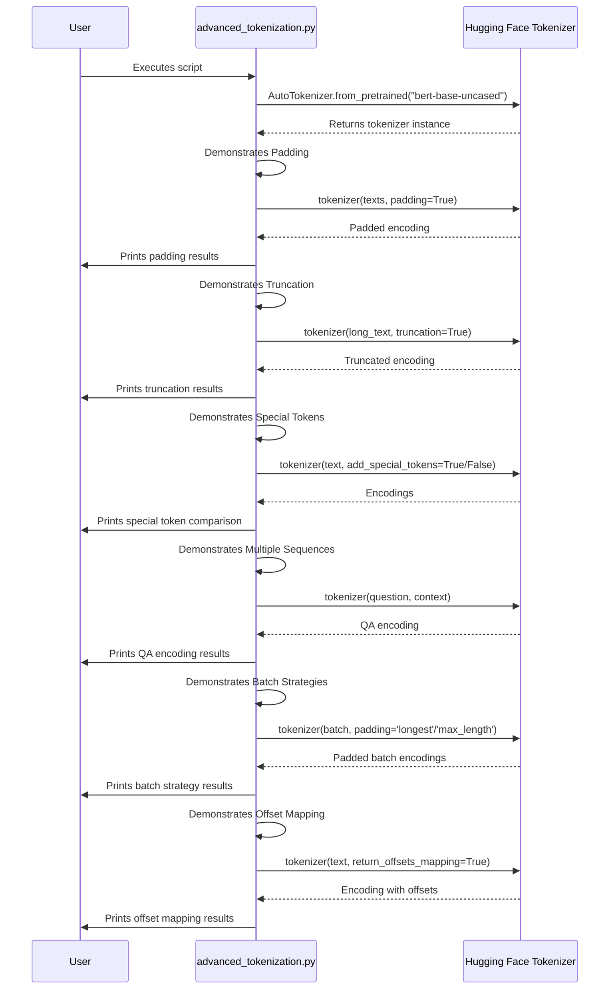

# Code Analysis for `src/advanced_tokenization.py`

## 1. Top-level Overview

This script provides a hands-on demonstration of several advanced features of Hugging Face tokenizers. It goes beyond basic text-to-token conversion to explain concepts that are critical for building real-world NLP applications, such as padding, truncation, handling special tokens, and processing multiple sequences.

**Entry Point:**

The script is intended to be run directly from the command line. This executes the `if __name__ == "__main__":` block, which in turn calls the main function, `run_advanced_tokenization_examples()`.

**High-Level Control Flow:**

The script proceeds through a series of six distinct demonstrations in a linear fashion:
1.  **Padding:** It shows how a batch of sentences with different lengths are padded to a uniform length, a requirement for batch processing in most models.
2.  **Truncation:** It demonstrates how to handle texts that are longer than a model's maximum input size by truncating them.
3.  **Special Tokens:** It explicitly shows the difference between tokenizing with and without special control tokens (like `[CLS]` and `[SEP]`) and lists the important special tokens for the `bert-base-uncased` model.
4.  **Multiple Sequences:** It simulates a question-answering scenario, showing how to tokenize a question and a context paragraph together as a single input for the model.
5.  **Batch Encoding Strategies:** It compares two different padding strategies: padding to the length of the longest sequence in the current batch (`'longest'`) versus padding to a fixed maximum length (`'max_length'`).
6.  **Offset Mapping:** It demonstrates how to get the character-level start and end positions for each token, which is crucial for tasks like highlighting answers in a text or named entity recognition.

## 2. Global Sequence Diagram

### Diagram Explanation

The user starts the script, which first initializes a `bert-base-uncased` tokenizer from the Hugging Face library. The script then methodically steps through each of the advanced concepts. For each concept, it calls the tokenizer with a specific set of parameters (e.g., `padding=True`, `truncation=True`, `return_offsets_mapping=True`) to get the corresponding output. It then prints a formatted explanation and the results of the operation to the user before moving on to the next concept.

## 3. Function-by-Function Analysis

### `run_advanced_tokenization_examples()`

-   **Purpose:** To execute and explain a series of demonstrations covering advanced tokenization techniques.
-   **Signature:** No parameters, returns `None`.
-   **Context:** This is the sole function in the script and contains all the demonstration logic.
-   **Side effects:**
    -   Prints detailed explanations and results to the standard output.
    -   May perform network I/O to download the tokenizer if not cached.

-   **Code Listing and Explanation (by section):**

    **1. Padding:**
    This section takes a batch of three sentences of varying lengths. When `padding=True` is used, the tokenizer automatically adds `[PAD]` tokens to the shorter sentences until they all match the length of the longest sentence in the batch. It also generates an `attention_mask` to tell the model which tokens are real (value 1) and which are padding (value 0).

    **2. Truncation:**
    This section creates an artificially long sentence. It first shows that without truncation, the number of tokens is very large. Then, by setting `truncation=True` and `max_length=20`, it demonstrates that the tokenizer cuts the text down to the specified maximum length.

    **3. Special Tokens:**
    This part clearly illustrates the effect of the `add_special_tokens` argument. When `True`, the tokenizer adds model-specific tokens like `[CLS]` at the beginning and `[SEP]` at the end. It also prints a list of the most important special tokens and their corresponding IDs for the BERT model.

    **4. Multiple Sequences:**
    This section shows how to handle inputs that consist of two distinct parts, like a question and a context. The tokenizer combines them, separated by a `[SEP]` token. Crucially, it also generates `token_type_ids` (a sequence of 0s and 1s) to inform the model which tokens belong to the first sequence (the question) and which belong to the second (the context).

    **5. Batch Encoding Strategies:**
    This demonstrates a finer point of padding. `padding='longest'` is the default dynamic strategy. `padding='max_length'` is used when you need all batches to have a consistent, fixed length, which can be more efficient on some hardware, at the cost of potentially adding more padding.

    **6. Offset Mapping:**
    By setting `return_offsets_mapping=True`, the tokenizer provides the start and end character indices for each token in the original string. The script then iterates through these mappings to print exactly which part of the original text corresponds to each token. This is extremely useful for tasks that require linking model outputs back to the source text.

## 4. Architectural Mapping

-   **Layers:** This is a single-layer, executable script designed for demonstration purposes. It acts as a client of the `transformers` library.
-   **Interfaces:** Its primary interface is with the `transformers.AutoTokenizer` class, calling it with various parameters to showcase different behaviors.
-   **Cross-cutting Concerns:**
    -   **Configuration:** It imports `MAX_LENGTH` from the `config.py` module, though it doesn't use it in the current version of the script.
    -   **Logging/Output:** All explanations and results are handled via `print` statements.

## 5. Diagram Generation

The most relevant diagrams are provided above. A class diagram is not applicable.
