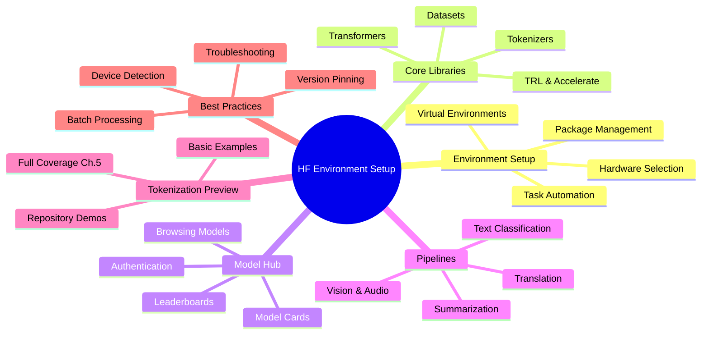
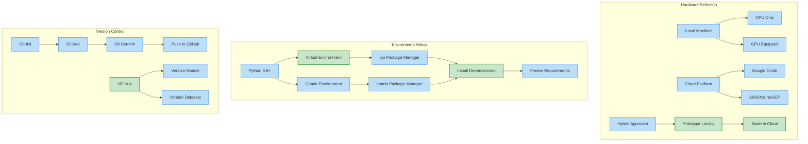
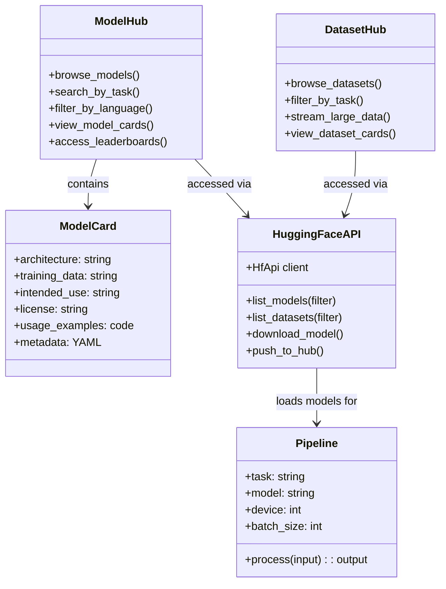
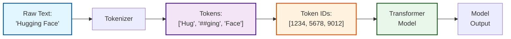
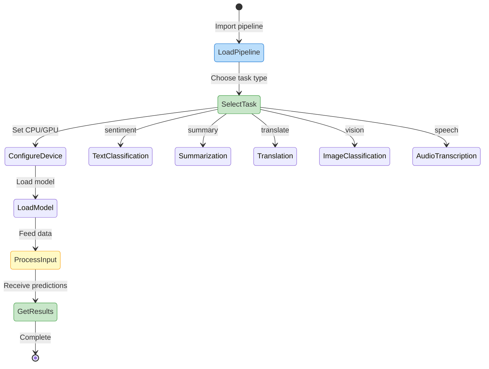

Welcome to the world of Hugging Face, the cornerstone of modern AI development. This comprehensive guide takes you step-by-step through setting up a robust environment for working with transformers—the technology powering today's most advanced AI applications.

Whether you're a seasoned machine learning engineer or just beginning your AI journey, this article provides everything you need to create a professional-grade workspace for exploring, fine-tuning, and deploying state-of-the-art models. No more configuration headaches or dependency nightmares—we'll build a solid foundation together.

By the end of this guide, you'll have:

- A fully configured environment optimized for AI development
- Direct access to thousands of pre-trained models from the Hugging Face Hub
- The ability to run powerful transformer models with just a few lines of code
- Understanding of best practices for reproducible AI workflows

Let's transform how you work with AI by setting up your ideal Hugging Face environment—your gateway to the exciting world of transformers awaits!

# Setting Up Your Hugging Face Environment: Hands-On Foundations - Article 3



**Step-by-Step Explanation:**

- Root node focuses on **HF Environment Setup** as the primary topic
- Branch covers **Environment Setup** with virtual environments, hardware, packages, and task automation
- Branch details **Core Libraries** including transformers, datasets, tokenizers, TRL, and accelerate
- Branch explores **Model Hub** with browsing, model cards, leaderboards, and authentication
- Branch demonstrates **Pipelines** for text, vision, and audio tasks
- Branch provides **Tokenization Preview** with examples and note about Chapter 5 coverage
- Branch highlights **Best Practices** including device detection, batch processing, version pinning, and troubleshooting

# Introduction: Your Passport to the Hugging Face Universe

## Environment Setup

Before diving into transformers, let's ensure you have the right environment. This repository provides complete working examples with multiple setup options:

### Poetry Setup (Recommended for Projects)

```bash
# Install poetry if not already installed
curl -sSL <https://install.python-poetry.org> | python3 -

# Create new project
poetry new huggingface-project
cd huggingface-project

# Add dependencies
poetry add transformers datasets accelerate tokenizers trl huggingface_hub
poetry add matplotlib seaborn pandas  # For visualizations
poetry add --group dev jupyter ipykernel pytest black ruff

# Activate environment
poetry shell

# Or use this repository's setup
task setup-complete  # Runs complete setup with all dependencies
```

**Repository Example:** See `pyproject.toml` for a complete dependency configuration including all required packages.

### Mini-conda Setup (Alternative)

```bash
# Download and install mini-conda from <https://docs.conda.io/en/latest/miniconda.html>

# Create environment with Python 3.10
conda create -n hf-env python=3.10
conda activate hf-env

# Install packages
conda install -c pytorch -c huggingface transformers datasets tokenizers
conda install -c conda-forge accelerate trl jupyterlab

# Or use the repository's conda setup
task conda-setup  # Creates conda environment
```

**Repository Example:** Run `task conda-create` or `task conda-setup` for automated conda environment creation.

### Traditional pip with pyenv

```bash
# Install pyenv (macOS/Linux)
curl <https://pyenv.run> | bash
# Configure shell (add to ~/.bashrc or ~/.zshrc)
export PATH="$HOME/.pyenv/bin:$PATH"
eval "$(pyenv init -)"

# Install Python 3.12.9 with pyenv
pyenv install 3.12.9
pyenv local 3.12.9

# Create virtual environment
python -m venv venv
source venv/bin/activate  # On Windows: venv\\Scripts\\activate

# Install packages
pip install transformers==4.53.0 datasets accelerate tokenizers trl jupyterlab

```

### Task Automation (Bonus)

This repository includes comprehensive task automation with Go Task:

```yaml
# Taskfile.yml example from this repository
version: '3'

tasks:
  setup:
    desc: "Set up Python environment"
    cmds:
      - pyenv install -s 3.12.9
      - pyenv local 3.12.9
      - poetry install

  run:
    desc: "Run all examples (interactive)"
    cmds:
      - poetry run python src/main.py

  # Environment examples
  run-pipeline:
    desc: "Run pipeline examples"
    cmds:
      - poetry run python src/pipeline_example.py

  # Tokenization examples  
  run-basic-tokenization:
    desc: "Run basic tokenization examples"
    cmds:
      - poetry run python src/basic_tokenization.py

  # Verification and testing
  verify-setup:
    desc: "Verify HuggingFace environment setup"
    cmds:
      - poetry run python src/verify_installation.py
```

**Repository Examples:** 
- Run `task` to see all available tasks
- Run `task setup-complete` for full environment setup
- Run `task run` for interactive example selection
- Run `task run-all` to run all examples automatically

Welcome to the Hugging Face universe, where cutting-edge AI lands within your reach. Think of this chapter as your passport: before exploring transformer models, you need the right setup. A solid environment lets you experiment, build, and innovate with confidence—ensuring your work remains reproducible and future-proof.

Why start here? A strong foundation saves hours of troubleshooting later. Like a chef needs a clean kitchen or a scientist needs the right tools, you need a reliable workspace for AI. This chapter assembles that toolkit step by step, using the latest best practices from the Hugging Face and Python communities.

By chapter's end, you'll master:

- Setting up virtual environments for safe, isolated development
- Installing and verifying core Hugging Face libraries with version pinning
- Authenticating with the Hugging Face Hub for seamless model access
- Understanding each tool's role in your workflow
- Running your first transformer-powered inference in seconds

## Why Environment Setup Matters

A cluttered workspace slows you down. In AI, a messy environment leads to wasted time fixing errors instead of building solutions. A clean, isolated setup keeps your work reproducible, avoids dependency conflicts, and lets you focus on ideas—not technical snags.

## Quick Note: Local vs. Cloud Environments

You can run Hugging Face code on your own machine or in cloud notebooks like Google Colab or Kaggle. Cloud notebooks offer quick starts—no installation required—but for production work or custom projects, a local environment proves essential. This chapter focuses on local setup, with notes for cloud users.

> 🔧 Common Setup Issues:
> 
> - `ModuleNotFoundError`: Check virtual environment activation
> - CUDA errors: Verify PyTorch GPU version matches your CUDA
> - Token authentication fails: Ensure token has read permissions
> - Slow downloads: Models cache in `~/.cache/huggingface`

## Step 1: Create a Virtual Environment (Recommended)

Virtual environments isolate your project's dependencies, preventing conflicts and ensuring reproducibility. This proves essential for modern AI development.

### Creating and Activating a Virtual Environment

```bash
# Create a new virtual environment named 'huggingface_env'
python -m venv huggingface_env

# Activate the environment (choose the command for your OS):
source huggingface_env/bin/activate      # On macOS/Linux
huggingface_env\\Scripts\\activate         # On Windows

```

**Step-by-Step Explanation:**

1. **Create environment**: `python -m venv` creates an isolated Python environment
2. **Activate environment**: Activation modifies your shell to use the environment's Python
3. **Work isolated**: All packages install only within this environment
4. **Deactivate when done**: Type `deactivate` to return to system Python

If you prefer Conda, use `conda create -n huggingface_env python=3.11` and `conda activate huggingface_env`.

## Step 2: Choose Your Hardware (CPU or GPU)

Most Hugging Face models run faster on GPUs. If your machine has a supported NVIDIA GPU, install PyTorch or TensorFlow with CUDA support before proceeding. For CPU-only users or cloud notebooks (like Colab), standard installs suffice.

> 💾 GPU Memory Guidelines:
> 
> - Small models (DistilBERT): 2-4GB VRAM
> - Medium models (BERT-base): 4-8GB VRAM
> - Large models (GPT-2-large): 8-16GB VRAM
> - Use `device_map="auto"` for automatic memory management

### Smart Device Detection Pattern

Here's a production-ready pattern for automatic device selection that prioritizes Apple Silicon MPS, then CUDA GPUs, then CPU:

```python
import torch

def get_device():
    """Get the best available device for pipelines (returns int or str)."""
    if torch.backends.mps.is_available():
        return "mps"  # Apple Silicon GPU
    elif torch.cuda.is_available():
        return 0  # Return 0 for first CUDA device
    else:
        return -1  # Return -1 for CPU in pipeline API

# Usage
device = get_device()
print(f"Using device: {device}")
```

**Repository Example:** See `src/config.py` for the complete device detection implementation used throughout all examples, including environment variable configuration and HuggingFace token management.

### Installing PyTorch with CUDA (for GPU Acceleration)

```bash
# Visit <https://pytorch.org/get-started/locally/> for the latest command for your system.
# Example for CUDA 12.1:
pip install torch==2.3.0 torchvision torchaudio --index-url <https://download.pytorch.org/whl/cu121>

```

**Step-by-Step Explanation:**

1. **Check CUDA version**: Run `nvidia-smi` to see your GPU and CUDA version
2. **Match PyTorch version**: Visit PyTorch website for the correct install command
3. **Install with index URL**: The `-index-url` points to GPU-enabled packages
4. **Verify GPU access**: Test with `torch.cuda.is_available()` in Python

Cloud notebooks (e.g., Colab) pre-install GPU drivers. For CPU-only installs, simply use `pip install torch==2.3.0`.

## Step 3: Define Your Project Requirements

Pinning package versions ensures your code works identically every time. Create a `requirements.txt` file for reproducibility.

### Example requirements.txt for Hugging Face Projects

```
transformers==4.41.0
datasets==2.20.0
torch==2.3.0
accelerate==0.30.0
evaluate==0.4.2

```

Add other libraries as needed. The versions above reflect stable releases as of mid-2025.

## Step 4: Install Hugging Face Libraries and Dependencies

Install all dependencies at once using your `requirements.txt`:

### Installing Dependencies from requirements.txt

```bash
pip install -r requirements.txt

```

**Step-by-Step Explanation:**

1. **Read requirements**: pip reads each line from requirements.txt
2. **Resolve dependencies**: pip finds compatible versions for all packages
3. **Download and install**: Packages download from PyPI and install
4. **Verify installation**: Check with `pip list` to see installed packages

Alternatively, to install the latest stable versions directly (not recommended for production):

`pip install transformers datasets torch accelerate evaluate`

## Step 5: Authenticate with the Hugging Face Hub

Some models and datasets require authentication. Logging in also lets you push models and track usage.

### Logging in to the Hugging Face Hub

```bash
huggingface-cli login

```

**Step-by-Step Explanation:**

1. **Run login command**: Starts interactive authentication
2. **Visit token page**: Go to https://huggingface.co/settings/tokens
3. **Create/copy token**: Generate a token with read permissions (write for uploading)
4. **Paste token**: Enter when prompted (characters won't display for security)

Follow the prompt to enter your Hugging Face access token. For programmatic use (e.g., CI/CD), set the `HUGGINGFACE_TOKEN` environment variable.

## Step 6: Verify Your Installation

Check everything works by running:

### Verifying Transformers, Datasets, and Accelerate Installation

```python
import transformers
import datasets
import accelerate
print("Transformers:", transformers.__version__)
print("Datasets:", datasets.__version__)
print("Accelerate:", accelerate.__version__)
```

**Repository Example:** Run `task verify-setup` for a comprehensive environment verification that checks all required packages, GPU availability, and provides detailed diagnostics. See `src/verify_installation.py` for the complete verification script.

**Step-by-Step Explanation:**

1. **Import libraries**: Python loads each package
2. **Access version**: `__version__` attribute contains version string
3. **Print results**: Display confirms successful installation
4. **Check versions**: Ensure versions match your requirements

If you see version numbers without errors, you're set. If not, check your Python, pip, and virtual environment setup.

## Step 7: Try It Now—Your First Hugging Face Pipeline

With your environment ready, run a real AI task in seconds. Let's perform sentiment analysis—a classic NLP example.

### Your First Hugging Face Pipeline: Sentiment Analysis

```python
from transformers import pipeline  # Import the pipeline API
# If this is your first run, models are downloaded automatically (auth required for some models)
classifier = pipeline('text-classification')  # Set up sentiment analysis
result = classifier("Hugging Face is transforming the way we build AI!")
print(result)  # Output: label and confidence
```

**Repository Examples:** 
- Run `task run-pipeline` to see comprehensive pipeline examples including sentiment analysis, text generation, zero-shot classification, and question answering
- See `src/pipeline_example.py` for complete working code with device detection and batch processing

**Step-by-Step Explanation:**

- **Import pipeline**: Load Hugging Face's high-level API
- **Create classifier**: `pipeline('text-classification')` loads a pre-trained sentiment model
- **Run inference**: Pass text to get predictions
- **View results**: Returns label (e.g., 'POSITIVE') and confidence score

**Try it now:** Change the input text and observe how sentiment predictions shift.

## Your AI Toolkit: Tools and Roles

Let's map each tool in your AI setup to its role in your scientific toolkit:

- **Python**: Your main workspace where everything happens
- **pip/conda**: Package managers—install and update libraries
- **Transformers, Datasets, Tokenizers**: Specialized Hugging Face libraries for models, data, and text processing
- **Accelerate**: Hardware abstraction and distributed training
- **Evaluate**: Standardized model evaluation
- **Git**: Version control—your project's history and collaboration tool

You don't need expertise in each tool yet. You'll learn as you go, with new terms defined as they appear.

## Quick Reference Table

| Tool | Role |
| --- | --- |
| Python | Main workspace |
| pip/conda | Installs and manages packages |
| Transformers | State-of-the-art models |
| Datasets | Data access and processing |
| Accelerate | Hardware abstraction, scaling |
| Evaluate | Model evaluation and metrics |
| Git | Version control and collaboration |

## Real-World Impact

With this setup, you can:

- Prototype solutions in minutes
- Test and compare models from the Model Hub quickly
- Scale up with Accelerate for multi-GPU or distributed training
- Benchmark results with Evaluate
- Collaborate using Git and shared environments

This means faster innovation, greater reproducibility, and lower costs—especially valuable in business projects.

## What's Next

In the next section, we'll guide you through choosing hardware (local or cloud), installing Python and Hugging Face libraries, and setting up Git. For troubleshooting setup or exploring the Model Hub, see Article 3. To dive deeper into pipelines, check Article 3's 'First Steps with Hugging Face Pipelines.'

# Preparing Your Development Environment



**Step-by-Step Explanation:**

- **Hardware Selection** shows three paths: Local (CPU/GPU), Cloud (Colab/AWS), or Hybrid
- **Environment Setup** illustrates Python installation, virtual environments, and dependency management
- **Version Control** demonstrates Git for code and Hugging Face Hub for models/datasets
- Highlighted nodes indicate recommended practices

A robust development environment forms your AI workshop. The right setup saves hours of frustration, enables reproducibility, and smooths every experiment. In this section, you'll choose hardware, install essential tools, and configure version control—the foundation for all Hugging Face projects.

### Choosing Your Hardware: Local, Cloud, or Hybrid?

First, decide where you'll run AI workloads. Your choice impacts speed, cost, scalability, and data privacy. Let's compare your main options:

**Local Machine**

- *CPU only*: Sufficient for basic experimentation or learning, but slow for large models or datasets
- *GPU-equipped*: Modern NVIDIA GPUs (RTX 30/40 series or higher) or Apple Silicon (M1/M2/M3) significantly accelerate training and inference. Ideal for individuals or small teams
- *Pros*: Full control, no ongoing cloud costs, data stays local
- *Cons*: Limited by hardware power and memory; may require complex driver/CUDA setup for GPUs

**Cloud Platforms**

- *Google Colab/Kaggle*: Free GPU/TPU access (with usage limits). Easy starts, ideal for learning and prototyping
- *AWS, Azure, GCP*: Scalable, pay-as-you-go access to powerful GPUs (A100, H100) and TPUs. Suitable for large-scale training, production, or collaborative teams
- *Pros*: Scalability, latest hardware, no maintenance, easy collaboration
- *Cons*: Ongoing costs, setup learning curve, data privacy and compliance considerations

**Hybrid Approach**
Prototype locally, then scale in the cloud as needs grow. Many professionals and organizations balance cost, flexibility, and performance this way.

**Business Tip:** Handling sensitive or regulated data? Consult IT or legal teams about cloud compliance. Major cloud providers offer robust security, but you must follow organizational policies.

Start small—Google Colab, Kaggle, or a local GPU suffices for most early projects. You can always upgrade or migrate to cloud as needs evolve. Once you've picked hardware, install your software tools.

### Installing Python, pip/conda, and Essential Packages

Python powers Hugging Face. Most AI tools—including PyTorch, TensorFlow, and Hugging Face libraries—run on Python. Here's how to set up your environment with current best practices.

**1. Check Your Python Version**
Python 3.9 or higher is recommended. Support for Python 3.8 faces deprecation in many libraries. Open a terminal and run:

### Check Python Version

```bash
python --version  # Or use python3 --version

```

If your version falls below 3.9 or Python is missing, download the latest from [python.org](https://www.python.org/downloads/).

**2. Create a Virtual Environment**
Virtual environments keep project dependencies isolated and reproducible. Use `venv` (built-in) or `conda` (recommended for complex or GPU setups).

### Create and Activate a Virtual Environment (venv)

```bash
# Using venv (built-in)
python -m venv hf-env
# Activate on Windows:
hf-env\\Scripts\\activate
# Activate on macOS/Linux:
source hf-env/bin/activate

```

### Create and Activate a Conda Environment (Recommended for GPU/ML)

```bash
# Using conda (install from <https://conda.io> if needed)
conda create -n hf-env python=3.10
conda activate hf-env

```

**Step-by-Step Explanation:**

1. **Create isolated space**: Virtual environment separates project dependencies
2. **Activate environment**: Changes your shell to use environment's Python
3. **Install packages**: Everything installs within this environment only
4. **Switch projects**: Deactivate and activate different environments as needed

When activated, your terminal prompt shows (hf-env). Always activate your environment before installing packages.

**Tip:** Conda excels at managing CUDA, cuDNN, and other binary dependencies required for GPU acceleration.

**3. Upgrade pip (if using venv)**
pip manages Python packages. Ensure it's current:

### Upgrade pip

```bash
python -m pip install --upgrade pip

```

**4. Install PyTorch or TensorFlow with GPU Support (Before Hugging Face Libraries)**
For GPU acceleration, install PyTorch (or TensorFlow) with the correct CUDA version for your hardware. Always follow official instructions at [pytorch.org](https://pytorch.org/get-started/locally/) or [tensorflow.org/install](https://www.tensorflow.org/install). For PyTorch with CUDA 12.1:

### Install PyTorch with CUDA 12.1 (pip example)

```bash
pip install torch torchvision torchaudio --index-url <https://download.pytorch.org/whl/cu121>

```

**Step-by-Step Explanation:**

1. **Identify CUDA version**: Check with `nvidia-smi` command
2. **Get install command**: PyTorch website generates the exact command
3. **Install with GPU support**: Downloads GPU-enabled packages
4. **Test GPU availability**: Verify with `torch.cuda.is_available()` in Python

For CPU-only machines or if you don't need GPU support:

```bash
pip install torch torchvision torchaudio

```

**Note:** Installing PyTorch or TensorFlow before Hugging Face libraries ensures correct backend detection.

**5. Install Hugging Face and Essential Libraries**
Install main Hugging Face packages:

- `transformers`: Models and pipelines (latest stable version is 4.41.0 as of July 2025)
- `datasets`: Efficient data loading and processing
- `tokenizers`: Fast tokenization (often installed with transformers, but can be added explicitly)
- `trl`: For advanced fine-tuning and RLHF/GRPO workflows
- `accelerate` and `deepspeed`: For multi-GPU and distributed training (see Article 17 for details)

### Install Hugging Face Core and Advanced Libraries

```bash
pip install transformers datasets tokenizers trl accelerate deepspeed

```

**Step-by-Step Explanation:**

1. **Install core libraries**: Transformers provides models, datasets handles data
2. **Add tokenizers**: Fast text processing for transformer models
3. **Include TRL**: Enables reinforcement learning and advanced fine-tuning
4. **Add scaling tools**: Accelerate and DeepSpeed for distributed training

**6. Capture Your Dependencies for Reproducibility**
To ensure others (and future you) can recreate your environment, freeze dependencies:

### Generate requirements.txt for pip environments

```bash
pip freeze > requirements.txt

```

### Generate environment.yml for conda environments

```bash
conda env export > environment.yml

```

**Step-by-Step Explanation:**

1. **Freeze current state**: Captures exact versions of all installed packages
2. **Save to file**: Creates shareable configuration file
3. **Recreate anywhere**: Others can install identical environment
4. **Track changes**: Commit these files to version control

To recreate the environment later or on another machine:

- For pip: `pip install -r requirements.txt`
- For conda: `conda env create -f environment.yml`

**7. Verify Your Installation**
Open a Python shell and try importing libraries:

### Verify Hugging Face Installation

```python
import transformers  # Should not error
import datasets      # Should not error
print(transformers.__version__)
print(datasets.__version__)
# Example output:
# 4.41.0
# 2.19.0

```

If you see version numbers without errors, you're set! If errors appear, double-check environment activation and package installation.

**Business Tip:** Always use virtual environments (venv or conda) per project, and pin dependencies with requirements.txt or environment.yml. This ensures reproducibility and prevents the "it works on my machine" problem.

You've now installed Python, pip/conda, and key Hugging Face libraries—ready for modern AI development. Next, let's secure your work with version control.

### Version Control with Git and Hugging Face Hub

Version control proves essential for any AI project. Git acts as your project's time machine, tracking every change, enabling safe experimentation, and making teamwork seamless. For model and dataset versioning, the Hugging Face Hub now sets the standard in the AI community.

**1. Install Git**
Check if Git is installed:

### Check Git Version

```bash
git --version  # Should print git version info

```

If not installed, download from [git-scm.com](https://git-scm.com/downloads) and follow OS-specific instructions.

**2. Initialize a New Git Repository**
Navigate to your project folder and run:

### Initialize Git Repository

```bash
git init              # Start tracking this folder
git add .             # Stage all files
git commit -m "Initial commit: Project setup"  # Save a snapshot

```

**Step-by-Step Explanation:**

1. **Initialize repository**: Creates `.git` folder to track changes
2. **Stage files**: Marks files for inclusion in next commit
3. **Commit changes**: Saves permanent snapshot with message
4. **Continue working**: Make changes, stage, and commit repeatedly

**3. Add a README**
Create a `README.md` file explaining your project's purpose and setup. This helps others (and future you) understand your work.

**4. Collaborate and Backup with GitHub**
Push your repository to [GitHub](https://github.com/) for safe backup and easy sharing. GitHub remains the standard for code versioning and collaboration.

**5. Version Models and Datasets with Hugging Face Hub**
The Hugging Face Hub enables seamless sharing, versioning, and documentation of models and datasets. Install the `huggingface_hub` package and log in:

### Install and Authenticate with Hugging Face Hub

```bash
pip install huggingface_hub
huggingface-cli login

```

**Step-by-Step Explanation:**

1. **Install Hub library**: Adds tools for interacting with Hugging Face Hub
2. **Authenticate**: Links your account for pushing/pulling private content
3. **Push models**: Upload trained models with version history
4. **Share datasets**: Version and document your datasets
5. **Collaborate**: Teams can work on shared models and datasets

Once logged in, push models, datasets, and even Spaces directly from scripts or notebooks. The Hub supports model cards, dataset documentation, and integrates with training workflows (see Article 14 for advanced sharing).

**Business Tip:** Use Git for code, experiment logs, data processing scripts, and configuration files. Use Hugging Face Hub for model and dataset versioning. This ensures full reproducibility—critical for research, regulated industries, and collaborative projects.

With Git and Hugging Face Hub configured, you're ready to build, experiment, and collaborate confidently.

### Quick Checklist and Next Steps

**Checklist—You should now have:**

- ✓ Chosen hardware (local, cloud, or hybrid)
- ✓ Installed Python 3.9+ and set up virtual environment (venv or conda)
- ✓ Installed PyTorch or TensorFlow with appropriate CUDA version (for GPU support)
- ✓ Installed Hugging Face libraries (transformers 4.41.0+, datasets, tokenizers, trl, accelerate, deepspeed)
- ✓ Captured dependencies with requirements.txt or environment.yml
- ✓ Initialized Git for code version control
- ✓ Configured Hugging Face Hub for model/dataset versioning

A solid environment saves debugging hours and makes AI projects portable, scalable, and reproducible.

Next, explore the Hugging Face Model Hub and run your first AI pipeline. For troubleshooting setup issues, see the appendix or Hugging Face documentation. For dataset management, advanced fine-tuning, and distributed training, see Articles 8, 11, 12, 13, and 17.

# Exploring the Model Hub, Datasets, and Leaderboards



**Step-by-Step Explanation:**

- **ModelHub** class shows browsing, searching, filtering, and leaderboard access
- **DatasetHub** provides similar functionality for datasets with streaming support
- **HuggingFaceAPI** handles programmatic access to both hubs
- **ModelCard** contains essential model documentation
- **Pipeline** uses models loaded from the Hub for inference

Think of Hugging Face as an app store for AI. Instead of apps, you'll find thousands of pre-trained models and datasets to boost your projects. Mastering how to browse, search, and select from these resources—using both web UI and Python APIs—proves essential for modern AI developers. Today, the Hub ecosystem also includes Spaces for interactive demos and community sharing.

This section teaches you to explore models and datasets, understand model documentation, and use leaderboards to compare performance. We'll use current examples and short code snippets, following best practices with the Hugging Face Hub and Datasets libraries.

### Navigating the Model Hub and Datasets Interface

The Model Hub serves as your central library for AI models. Browse by category, search for exact needs, and preview how each model works. The Datasets library organizes similarly, offering curated datasets for training and testing. Both models and datasets benefit from structured metadata, powering advanced filtering on the website and via API.

Two main ways exist to explore these resources:

1. **Web Interface:** Visit [huggingface.co/models](https://huggingface.co/models) or [huggingface.co/datasets](https://huggingface.co/datasets). Use filters for task (like text-classification), language, library (PyTorch, TensorFlow), license, and more. Each model or dataset features a dedicated page with documentation, structured YAML metadata, and often an interactive demo via Hugging Face Spaces.
2. **Python API:** For programmatic access, use the `huggingface_hub` library to search and load resources directly in code. This approach excels for automation, reproducibility, and integrating model selection into ML workflows.

Let's list models for a specific task using the latest Hugging Face Hub API. This automates model discovery and integrates model selection into workflows. Note that string-based filters face deprecation; use the `ModelFilter` class for robust, forward-compatible queries.

### Listing Available Models with the Hugging Face Hub API

```python
from huggingface_hub import HfApi

api = HfApi()  # Create an API client for the Hugging Face Hub

# List all models for the 'text-classification' task
models = list(api.list_models(task="text-classification"))

print(f"Found {len(models)} text-classification models!")
```

**Repository Example:** Run `task run-hub-api` to see complete HuggingFace Hub API examples including model search, authentication, and filtering. See `src/hf_hub_example.py` for working code.

**Note:** The ModelFilter class has been deprecated in newer versions of huggingface_hub. Use direct parameters instead.

**Step-by-Step Explanation:**

- Import `HfApi` and `ModelFilter` from `huggingface_hub` (official Hub interaction method)
- Create API client for programmatic access
- Use `list_models()` with `ModelFilter` to get task-relevant models
- Print discovery count

**Tip:** Filter by architecture (e.g., `ModelFilter(architecture="bert")`), organization, language, and more. Refer to [API docs](https://huggingface.co/docs/huggingface_hub/main/en/package_reference/hf_api#huggingface_hub.ModelFilter) for all options.

To list available datasets, use `list_datasets` from `huggingface_hub`. This approach mirrors model listing and supports advanced filtering.

### Listing Available Datasets with Hugging Face Hub

```python
from huggingface_hub import list_datasets

datasets_list = list_datasets()  # Get all available datasets
print(f"There are {len(datasets_list)} datasets on the Hub!")

```

**Step-by-Step Explanation:**

1. **Import function**: Load dataset listing utility
2. **Call list_datasets**: Retrieves all available datasets
3. **Count results**: Shows total dataset availability
4. **Filter options**: Use `DatasetFilter` for specific needs

This method quickly reveals available datasets. Filter by task, language, or other metadata using `DatasetFilter` (see documentation). For large datasets, the `datasets` library supports streaming, processing data efficiently without full downloads.

**Modern Features to Explore:**

- Many model and dataset pages feature Hugging Face Spaces—interactive apps for browser-based model testing
- Structured YAML metadata in model cards enhances search, filtering, and leaderboard integration
- For advanced workflows, use `hf_hub_download` to fetch specific model files or assets

> 🚀 Testing Models with Spaces:
Before downloading a model, test it in Spaces:
> 
> 
> ```python
> # Quick way to test a model's Space before downloading
> # Visit: <https://huggingface.co/spaces/{username}/{space-name}>
> # Example: <https://huggingface.co/spaces/stabilityai/stable-diffusion>
> 
> ```
> 

**Key Takeaway:**

- Use web interface for quick browsing, filtering, and accessing community demos (Spaces)
- Use Python API via `huggingface_hub` for automation, advanced filtering, and reproducible workflows

### Searching for and Selecting Pre-trained Models

With thousands of models available, picking the right one feels like laptop shopping—many choices, but only a few fit your needs. The Hugging Face Hub helps narrow options with robust filters, clear model tags, and structured metadata.

On the Model Hub website, filter by task, language, library, license, and more. Tags enable fast discovery. For example, finding an English sentiment analysis model requires selecting 'text-classification' and filtering by language. Popular models often link to Spaces, letting you test interactively before downloading.

Click a model to open its model card. This page includes:

- **Architecture:** Model type (e.g., BERT, RoBERTa, DistilBERT)
- **Training Data:** Dataset used for training
- **Intended Use:** Recommended tasks and scenarios
- **License:** Usage restrictions (crucial for business or commercial use)
- **Usage Examples:** Code snippets for quick starts
- **Structured Metadata:** YAML front matter powers search, filtering, and leaderboard placement
- **Space Demo (if available):** Try the model live in your browser

Let's load a popular sentiment analysis model using the Transformers library. We'll use `distilbert-base-uncased-finetuned-sst-2-english`, a lightweight model fine-tuned for English sentiment classification. Models and tokenizers download automatically and cache locally.

### Loading a Pre-trained Model (Current Best Practice)

```python
from transformers import AutoModelForSequenceClassification, AutoTokenizer

model_name = "distilbert-base-uncased-finetuned-sst-2-english"

# Download the tokenizer for input text processing
# (A tokenizer splits text into tokens the model understands)
tokenizer = AutoTokenizer.from_pretrained(model_name)

# Download the model weights and configuration
model = AutoModelForSequenceClassification.from_pretrained(model_name)
```

**Repository Example:** Run `task run-model-download` to see comprehensive model downloading examples including caching, different model types, and memory usage. See `src/model_download_example.py` for complete implementation.

**Step-by-Step Explanation:**

- `AutoTokenizer` and `AutoModelForSequenceClassification` automatically select correct classes based on model name
- `from_pretrained()` downloads and caches model and tokenizer
- Tokenizer prepares input text; model performs prediction
- Caching prevents re-downloading on subsequent runs

**Tip:** Unsure which model to start with? Pick well-known architectures (like BERT or DistilBERT) fine-tuned for your task. Experiment with specialized models later. For advanced use cases, download model files directly using `hf_hub_download` from `huggingface_hub`.

**Key Takeaway:**

- Use filters, tags, and structured model cards to quickly identify best models for projects
- Loading and using models in code proves fast and consistent across the Hub
- Spaces provide convenient evaluation before downloading

### Understanding Model Documentation, Licenses, and Leaderboards

Selecting models involves more than performance. You need to understand what you're getting, usage rights, and competitive positioning. Model cards, licenses, and leaderboards provide this crucial information. Recent advances include structured YAML metadata in model cards and growing Spaces usage for interactive demos.

**Model Cards:**
Model cards function like product datasheets. They summarize model capabilities, training details, strengths, weaknesses, and ethical considerations. Look for sections like:

- **Intended Use**: Typical applications (e.g., summarization, sentiment analysis)
- **Limitations**: Warnings about struggle areas (e.g., certain languages or sensitive topics)
- **Training Data**: Datasets used, affecting bias and generalizability
- **Ethical Considerations**: Potential risks or misuse scenarios
- **Structured Metadata (YAML front matter):** Machine-readable metadata powers advanced search, filtering, and leaderboard inclusion

**Licenses:**
Every model and dataset includes a license defining usage, modification, and sharing rights. Common licenses include Apache 2.0, MIT, or research-only. Always check licenses, especially for commercial products. Licenses display prominently on each model or dataset page.

**Leaderboards:**
Leaderboards track public model performance on standard benchmarks. Examples include GLUE and SuperGLUE for language understanding, SQuAD for question answering, and BLEU or ROUGE for translation and summarization. Leaderboards help you:

- Compare accuracy, speed, and efficiency
- Find state-of-the-art models for tasks
- Weigh trade-offs (higher accuracy vs. faster inference)

Find leaderboards on the Hugging Face website under "Leaderboard" tabs or linked from model pages. Only models with complete structured metadata qualify for inclusion.

For text summarization work, check the [Summarization Leaderboard](https://huggingface.co/leaderboards/summarization) to compare top models on ROUGE or BLEU metrics (standard summary quality measures). Many leaderboard models link to Spaces for interactive testing.

**Business Insight:** Use leaderboards and Spaces to justify model choices to stakeholders—demonstrate your selection ranks among the best for your use case, with live performance demos.

**Key Takeaway:**

- Always review model cards and licenses before deployment
- Use leaderboards to benchmark and compare models for needs
- Structured metadata and Spaces prove essential for transparency, discoverability, and community engagement

# Tokenization Preview: A Quick Introduction



Before transformer models can process text, it must be converted into numbers. Tokenization is this critical conversion process. While Chapter 5 covers tokenization in depth, here's a quick preview with working examples from our repository.

**Repository Examples to Try:**
- Run `task run-basic-tokenization` for hands-on basic tokenization examples
- Run `task run-subword-tokenization` to compare different tokenization methods
- Run `task run-advanced-tokenization` for padding, truncation, and special tokens
- See `src/tokenizer_comparison.py` for performance benchmarks

**Note:** This is just a preview. Chapter 5 provides comprehensive coverage of tokenization concepts, including BPE, WordPiece, SentencePiece, handling out-of-vocabulary words, and optimization strategies.
- Run `task test-oov` to see how tokenizers handle out-of-vocabulary words

## Quick Tokenization Example

Here's a simple example to see tokenization in action:

```python
from transformers import AutoTokenizer

# Load a tokenizer
tokenizer = AutoTokenizer.from_pretrained("bert-base-uncased")

# Tokenize some text
text = "Hugging Face makes NLP easy!"
tokens = tokenizer.tokenize(text)
print(f"Text: {text}")
print(f"Tokens: {tokens}")
# Output: ['hugging', 'face', 'makes', 'nl', '##p', 'easy', '!']
```

Notice how "NLP" becomes ['nl', '##p'] - this is subword tokenization in action. The repository includes many more examples showing different tokenization methods, handling special tokens, padding, and performance comparisons.

**Want to learn more?** Chapter 5 dives deep into tokenization theory and practice, covering:
- How different tokenization methods work (BPE, WordPiece, SentencePiece)
- Handling out-of-vocabulary words
- Special tokens and their purposes
- Performance optimization strategies

## Try the Repository Examples

The repository includes comprehensive tokenization examples you can run right now:

```bash
# Compare different tokenization methods
task run-subword-tokenization

# See advanced features like padding and truncation
task run-advanced-tokenization

# Benchmark tokenizer performance
task run-comparison
```

These examples demonstrate concepts that Chapter 5 will explain in detail, including how BERT, GPT, and T5 tokenize text differently.


## Key Tokenization Tips

1. **Always use the matching tokenizer**: Each model requires its specific tokenizer
2. **Use batch processing**: Process multiple texts together for efficiency
3. **Enable fast tokenizers**: Use `use_fast=True` for better performance

**Full tokenization coverage in Chapter 5** includes best practices, performance optimization, special token handling, and real-world applications.

# First Steps with Hugging Face Pipelines



**Step-by-Step Explanation:**

- Process starts with **LoadPipeline** importing the pipeline API
- **SelectTask** chooses from text, vision, or audio tasks
- **ConfigureDevice** sets CPU or GPU usage
- **LoadModel** fetches the appropriate model
- **ProcessInput** feeds your data
- **GetResults** returns predictions
- Branch shows available task types

Want to build an AI prototype in minutes, not days? Hugging Face pipelines make it possible. With just one line of code, apply state-of-the-art models to your data—no deep machine learning knowledge required. Whether you're a data scientist testing ideas or a developer building demos, pipelines shortcut you to real results. Modern pipelines support growing task sets across text, vision, and audio, with easy configuration for batching, hardware acceleration, and custom model selection.

*Note: All examples assume `transformers>=4.40.0` for compatibility with latest features.*

### What Are Pipelines and Why Use Them?

A Hugging Face pipeline works like a plug-and-play AI appliance. Give it data, and it handles the rest—no manual wiring needed. Under the hood, pipelines manage three main steps:

1. **Model Loading:** Fetches pre-trained models for your task (e.g., sentiment analysis, translation, image classification), either by default or from specific Hub models
2. **Tokenization / Preprocessing:** Converts raw input (text, images, audio) into numerical representations models require
3. **Pre- and Post-processing:** Prepares inputs, runs inference (model's prediction step), and formats outputs for immediate use

Pipelines now support wide-ranging tasks including text, vision, audio, and multimodal applications. They excel for quick experiments, demos, and learning concepts. Features like batching, device placement (CPU/GPU), and custom model selection scale pipelines from simple prototypes to efficient production inference.

For teams and businesses, pipelines accelerate the journey from idea to working prototype. Instead of spending days wiring components, test ideas and show results in minutes. For advanced needs, integrate pipelines with optimized inference backends (Hugging Face Optimum, ONNX Runtime, or DeepSpeed) for high-throughput or hardware-accelerated scenarios.

### Quick-Start Examples: Text, Vision, and Audio Pipelines

Let's tackle essential AI tasks hands-on: text classification, summarization, translation, image classification, and audio transcription. Each demonstrates how single commands deliver powerful AI capabilities, leveraging batching, device selection, and custom model selection.

First, install the latest Transformers library (version 4.40.0 or higher recommended):

### Install Hugging Face Transformers

```bash
pip install --upgrade "transformers>=4.40.0"

```

Now explore each pipeline in action. Try changing input data or parameters to see different results.

### 1. Text Classification

Text classification assigns labels to input text. Common uses include sentiment analysis, topic tagging, or spam detection. Modern pipelines enable batching and device selection, with Hub model specification for reproducibility.

### Text Classification with Batching and Device Selection

```python
from transformers import pipeline
import torch

# Use GPU if available, otherwise fallback to CPU
device = 0 if torch.cuda.is_available() else -1

# Create a text classification pipeline with a specific model
classifier = pipeline(
    "text-classification",
    model="distilbert-base-uncased-finetuned-sst-2-english",
    device=device
)

# Classify multiple sentences in a batch
sentences = [
    "Hugging Face is changing the world!",
    "This library makes machine learning easy.",
]
results = classifier(sentences, batch_size=2)
print(results)

```

**Step-by-Step Explanation:**

- Import `pipeline` function and detect GPU availability
- Create text classification pipeline, explicitly specifying a well-known sentiment analysis model
- Pass sentence list for batch inference using `batch_size` parameter
- Results return as dictionaries with labels and confidence scores

Example output:

```json
[
  {"label": "POSITIVE", "score": 0.9998},
  {"label": "POSITIVE", "score": 0.9997}
]

```

**Note:** Always check output schema in documentation or by inspecting output, as new keys may appear in future releases.

### 2. Summarization

Summarization condenses long passages into key-point summaries. Perfect for news aggregation, executive summaries, or reducing information overload. Pipelines handle long inputs through chunking and support batching.

**Repository Example:** See `src/pipeline_example.py` for working summarization examples including text generation with distilgpt2.

### Summarization with Custom Model and Batching

```python
from transformers import pipeline
import torch

device = 0 if torch.cuda.is_available() else -1

summarizer = pipeline(
    "summarization",
    model="facebook/bart-large-cnn",
    device=device
)

texts = [
    "Hugging Face provides a vast ecosystem for transformer models, making state-of-the-art AI accessible to everyone. This enables rapid experimentation and deployment.",
    "Transformers are revolutionizing natural language processing by enabling models to understand context at scale."
]

summaries = summarizer(texts, batch_size=2, max_length=50, min_length=20, do_sample=False)
print(summaries)

```

**Step-by-Step Explanation:**

- Pipeline loads summarization model (BART-large-CNN from Hub)
- Provide text list for batch summarization
- Set length constraints with `max_length` and `min_length`
- Results include `summary_text` key (schema may evolve)

Example output:

```json
[
  {"summary_text": "Hugging Face offers a comprehensive ecosystem for transformer models, enabling rapid prototyping and deployment."},
  {"summary_text": "Transformers are changing NLP by allowing models to grasp context at scale."}
]

```

For very long documents, adjust `max_length` and `min_length` parameters. Refer to documentation for streaming or chunked processing.

### 3. Translation

Translation pipelines convert text between languages—perfect for chatbots, support tools, or content localization. Select from hundreds of Hub translation models.

**Repository Example:** See `src/translation_example.py` for comprehensive translation examples including batch processing, multilingual translations, and reverse translation (back-translation) demonstrations. Run with `task run-translation`.

### Translation with Custom Model and Device Placement

```python
from transformers import pipeline
import torch

device = 0 if torch.cuda.is_available() else -1

translator = pipeline(
    "translation_en_to_fr",
    model="Helsinki-NLP/opus-mt-en-fr",
    device=device
)

sentences = ["Hugging Face makes AI easy.", "Transformers are powerful."]
translations = translator(sentences, batch_size=2)
print(translations)

```

**Step-by-Step Explanation:**

- Pipeline loads specific English-to-French translation model
- Pass English sentence list for batch translation
- Results contain `translation_text` key (check documentation for updates)

Example output:

```json
[
  {"translation_text": "Hugging Face facilite l'IA."},
  {"translation_text": "Les transformers sont puissants."}
]

```

Swap sentences or try other language pairs by changing models.

### 4. Image Classification (Vision)

Pipelines support computer vision tasks like image classification. Use built-in models or select from the Hugging Face Hub.

### Image Classification Pipeline

```python
from transformers import pipeline
import torch

device = 0 if torch.cuda.is_available() else -1

image_classifier = pipeline(
    "image-classification",
    model="google/vit-base-patch16-224",
    device=device
)

# Replace with your own image path or URL
result = image_classifier("path/to/image.jpg")
print(result)

```

**Step-by-Step Explanation:**

- Uses Vision Transformer (ViT) model for image classification
- Accepts image file path or URL
- Returns dictionaries with `label` and `score` keys
- Process multiple images by passing file path list

### 5. Audio Transcription (Speech-to-Text)

Audio pipelines enable automatic speech recognition (ASR) using models like Wav2Vec2.

**Repository Example:** See `src/speech_recognition_example.py` for ASR examples including multilingual speech recognition and performance considerations. Run with `task run-speech`.

### Automatic Speech Recognition Pipeline

```python
from transformers import pipeline
import torch

device = 0 if torch.cuda.is_available() else -1

asr = pipeline(
    "automatic-speech-recognition",
    model="facebook/wav2vec2-base-960h",
    device=device
)

# Replace with your own audio file (wav, mp3, etc.)
result = asr("path/to/audio.wav")
print(result)

```

**Step-by-Step Explanation:**

- ASR pipeline transcribes spoken words to text
- Supports various audio formats (wav, mp3, etc.)
- Output typically contains `text` key
- Check latest schema in documentation

### Key Takeaways

- Pipelines automate model loading, tokenization/preprocessing, batching, device placement, and inference
- Perform classification, summarization, translation, image classification, audio transcription, and more with single commands
- Support batching (`batch_size`), device selection (`device`), and custom models (`model`), suitable for prototyping and scalable production
- For high-performance or specialized deployments, explore Hugging Face Optimum, ONNX Runtime, or hardware-accelerated backends
- Output schemas may evolve; inspect output and consult documentation for latest details

**Repository Examples:** 
- `src/pipeline_example.py` - Complete pipeline examples for sentiment analysis, text generation, zero-shot classification, and question answering
- `src/translation_example.py` - Batch translation and multilingual examples
- `src/speech_recognition_example.py` - Audio transcription with ASR models
- Run all pipeline examples with `task run-pipeline`

### Business Use Cases for Rapid Prototyping

Why do pipelines matter for business? They enable fast idea testing—at any scale. Imagine startups analyzing 1,000 customer reviews for sentiment in five minutes, or enterprises processing thousands of images for content moderation, all without custom infrastructure.

Key business benefits:

- **Faster time-to-market:** Demo AI features before competitors react
- **Lower technical barriers:** Non-experts experiment with advanced models using simple APIs
- **Risk reduction:** Validate concepts with real data before heavy investment
- **Scalability:** Batch processing and device selection scale pipelines from prototypes to production workloads

Pipelines shine in hackathons, internal innovation sprints, and educational workshops—anywhere you need rapid idea-to-demo transformation. For production or high-throughput scenarios, integrate pipelines with optimized inference backends (Hugging Face Optimum or ONNX Runtime) for even greater performance.

Try it yourself: Change input data, batch size, device, or model in any example above and observe output changes. Pipelines make exploring transformers and multimodal AI easy—whether building quick demos or scalable business solutions.

# Troubleshooting Common Issues

When setting up your Hugging Face environment, you might encounter some common issues. Here are solutions based on real-world experience:

**Repository Examples:** 
- See `src/config.py` for robust device detection handling MPS/CUDA/CPU
- See `src/verify_installation.py` for comprehensive environment verification
- See fixes implemented in `src/hf_hub_example.py` for API deprecation handling
- Run verification with `task verify-setup`

## Installation Issues

### SentencePiece Build Errors (macOS)
If you encounter build errors with `sentencepiece` on macOS:

```bash
# Error: subprocess.CalledProcessError: Command '['./build_bundled.sh', '0.1.99']' returned non-zero exit status 127

# Solution: Use a newer version
pip install sentencepiece>=0.2.0
```

### Poetry Lock File Issues
When dependencies change significantly:

```bash
# Error: pyproject.toml changed significantly since poetry.lock was last generated

# Solution: Update the lock file
poetry lock
poetry install
```

### CUDA Version Mismatches
```bash
# Check your CUDA version
nvidia-smi

# Install PyTorch with matching CUDA version
# Visit https://pytorch.org/get-started/locally/ for the correct command
```

## Tokenization Issues

### Token Limit Exceeded
```python
# Problem: Text too long for model
# Solution: Use truncation
inputs = tokenizer(long_text, truncation=True, max_length=512)
```

### Mismatched Tokenizers
```python
# Problem: Using wrong tokenizer for a model
# Solution: Always load tokenizer with the model
tokenizer = AutoTokenizer.from_pretrained(model_name)
model = AutoModel.from_pretrained(model_name)
```

### Special Token Errors
```python
# Problem: Model expects special tokens but they're missing
# Solution: Ensure add_special_tokens=True (default)
inputs = tokenizer(text, add_special_tokens=True)
```

## Performance Issues

### Slow Tokenization
```python
# Use fast tokenizers when available
tokenizer = AutoTokenizer.from_pretrained("bert-base-uncased", use_fast=True)

# Process in batches
batch_size = 32
for i in range(0, len(texts), batch_size):
    batch = texts[i:i+batch_size]
    encodings = tokenizer(batch, padding=True, truncation=True)
```

### Out of Memory Errors
```python
# Use smaller batch sizes
# Clear GPU cache periodically
import torch
torch.cuda.empty_cache()

# Use mixed precision training
from torch.cuda.amp import autocast
with autocast():
    outputs = model(**inputs)
```

# Summary and Next Steps

Congratulations! You've mastered two critical foundations: setting up a robust Hugging Face environment AND understanding tokenization—the gateway to NLP. This dual foundation empowers you to build, experiment, and deploy transformer models with confidence. Let's recap your accomplishments and chart your path forward.

### 1. Modern Environment Setup: Your AI Launchpad

Reliable environments start with isolation and reproducibility. Professional AI workflows always use virtual environments (via `venv` or `conda`) to prevent dependency conflicts and ensure project consistency. Whether working locally, in cloud, or hybrid setups, activate virtual environments before installing packages—this is best practice. GPUs—local or cloud—dramatically accelerate model training and inference. Git remains essential for tracking code changes and team collaboration.

### Create and Activate a Virtual Environment (Python 3.8+)

```bash
# Create a new virtual environment
python -m venv huggingface_env

# Activate the environment
# On Windows:
huggingface_env\\Scripts\\activate
# On macOS/Linux:
source huggingface_env/bin/activate

```

After activation, install dependencies inside the virtual environment. This keeps projects isolated and reproducible.

### Install Hugging Face Libraries with Version Pinning

```bash
# Install core Hugging Face libraries with specific versions for reproducibility
pip install transformers==4.40.0 datasets==2.20.0 tokenizers==0.19.0 trl==0.8.0 huggingface_hub==0.23.0

# Freeze your environment to requirements.txt for sharing
pip freeze > requirements.txt

```

**Step-by-Step Explanation:**

1. **Install with versions**: Specify exact versions for consistency
2. **Freeze environment**: Capture all dependencies
3. **Share easily**: Others recreate identical environment
4. **Track changes**: Commit requirements.txt to version control

Pinning versions and maintaining `requirements.txt` ensures you and collaborators exactly reproduce environments.

### Recreate the Environment from requirements.txt

```bash
# To recreate the environment on another machine
pip install -r requirements.txt

```

Don't forget version control for code. Initialize Git repositories in project folders to track changes and enable collaboration.

### Initialize Git for Code Version Control

```bash
# In your project directory
git init
git add .
git commit -m "Initial commit: Project setup"

```

For collaborative projects, also use Hugging Face Hub to version and share models and datasets—just as you use Git for code.

### 2. Hugging Face Libraries: Your Modern AI Toolkit

Installing `transformers`, `datasets`, `tokenizers`, and latest additions like `trl` (for advanced fine-tuning and reinforcement learning) and `huggingface_hub` (for model/dataset versioning and authentication) unlocks a powerful, flexible toolkit. These libraries provide access to state-of-the-art models and datasets with minimal code.

### Verify Your Hugging Face Installation

```python
import transformers, datasets, tokenizers, trl, huggingface_hub
print("Transformers version:", transformers.__version__)
print("Datasets version:", datasets.__version__)
print("Tokenizers version:", tokenizers.__version__)
print("TRL version:", trl.__version__)
print("HuggingFace Hub version:", huggingface_hub.__version__)

```

**Repository Example:** Run `task verify-setup` or `python src/verify_installation.py` for comprehensive environment verification including device detection and package checks.

**Step-by-Step Explanation:**

1. **Import libraries**: Test each installation
2. **Print versions**: Confirm successful setup
3. **Check compatibility**: Ensure versions match requirements
4. **Ready for work**: Environment prepared for advanced workflows

Version numbers printed without errors confirm your environment readiness for advanced Hugging Face workflows.

### 3. Hugging Face Hub: Authentication and Model Versioning

Modern Hugging Face projects use the Hub for downloading, uploading, and versioning models and datasets. Authenticate with the Hub to push and manage assets securely.

### Authenticate with the Hugging Face Hub

```python
from huggingface_hub import login
login()  # This will prompt you for your Hugging Face access token

```

Once logged in, push models and datasets to the Hub for collaboration, sharing, and reproducibility—mirroring modern code workflows with GitHub.

**Repository Examples:** 
- Run `task hf-login` for CLI authentication
- See `src/hf_hub_example.py` for Hub API usage including model listing and dataset exploration
- See `src/model_download_example.py` for downloading and caching models
- Token is automatically loaded from `.env` file in all examples

### 4. Exploring the Model Hub and Datasets: Ready-Made AI

The Hugging Face Model Hub (https://huggingface.co/models) provides thousands of pre-trained models covering tasks from sentiment analysis to translation and beyond. The Datasets Hub offers curated datasets for training and evaluation. Use search, filters, and model cards to select assets fitting your needs, always checking licenses and intended use.

### Load a Pre-trained Sentiment Analysis Model

```python
from transformers import AutoTokenizer, AutoModelForSequenceClassification
model_name = "distilbert-base-uncased-finetuned-sst-2-english"
tokenizer = AutoTokenizer.from_pretrained(model_name)
model = AutoModelForSequenceClassification.from_pretrained(model_name)

```

**Step-by-Step Explanation:**

- `model_name` specifies exact Hub model
- `AutoTokenizer` loads compatible tokenizer
- `AutoModelForSequenceClassification` loads model weights for task
- Automatic caching prevents re-downloads

You can now use powerful models with minimal setup.

### 5. Tokenization Mastery: Converting Text to Model Input

You've learned how tokenization bridges human text and model understanding:
- **Basic concepts**: How text becomes tokens and then token IDs
- **Subword methods**: BPE, WordPiece, SentencePiece, and Tiktoken differences
- **Advanced features**: Padding, truncation, attention masks, and offset mapping
- **Performance optimization**: Batch processing and fast tokenizers
- **Best practices**: Matching tokenizers to models, handling special tokens

### 6. Pipelines: Instant Results for Prototyping

Pipelines provide high-level abstractions handling model loading, tokenization, and inference. This enables idea-to-prototype transformation in seconds using latest Hub models.

### Run a Sentiment Analysis Pipeline

```python
from transformers import pipeline
classifier = pipeline('text-classification')
result = classifier("The new product update is fantastic!")
print(result)  # Example output: [{'label': 'POSITIVE', 'score': 0.99}]

```

You receive predictions and confidence scores instantly. Try your own text to see model responses.

### Why These Practices Matter for Real-World AI Projects

- **Reproducibility:** Virtual environments and pinned dependencies ensure consistent, shareable experiments
- **Speed:** Pipelines and pre-trained models deliver prototypes and proofs-of-concept in days, not months
- **Collaboration:** Git and Hugging Face Hub enable seamless teamwork, code/model sharing, and versioning
- **Risk Management:** Model cards, licenses, and dataset versioning help evaluate assets for ethical, legal, and business use

**Tip:** Always backup code on GitHub and push models/datasets to Hugging Face Hub for full project traceability.

### Recap: Your Modern AI Toolkit Checklist

Environment Setup:
- ✓ Choose hardware or cloud resources fitting project needs
- ✓ Create and activate virtual environments for isolation
- ✓ Install Python, pip, and Hugging Face libraries with pinned versions
- ✓ Use Git for code version control and Hugging Face Hub for model/dataset versioning
- ✓ Generate and maintain requirements.txt for reproducibility
- ✓ Implement smart device detection for portable code

Tokenization Preview:
- ✓ See how text converts to tokens with quick examples
- ✓ Run repository examples to explore different tokenization methods
- ✓ Understand the importance of matching tokenizers to models
- ✓ Preview concepts covered fully in Chapter 5

Model and Pipeline Usage:
- ✓ Authenticate with Hugging Face Hub to push and manage assets
- ✓ Browse Model and Datasets Hub for pre-trained resources
- ✓ Prototype rapidly with pipelines
- ✓ Apply troubleshooting solutions for common issues

### Glossary (Quick Reference)

Environment and Tools:
- **Virtual Environment:** Isolated Python environment for managing dependencies
- **Model Hub:** Online repository for pre-trained and community models
- **Dataset Hub:** Repository for curated datasets for training and evaluation
- **Pipeline:** High-level API for running models on data with minimal code
- **Model Card:** Documentation describing model's purpose, data, and limitations
- **Leaderboard:** Ranking of models on benchmark tasks
- **Version Control:** System for tracking changes in code (Git) and models/datasets (Hugging Face Hub)
- **TRL:** Hugging Face library for advanced fine-tuning and reinforcement learning with LLMs

Tokenization Terms:
- **Token:** Smallest unit of text that a model processes (word, subword, or character)
- **Tokenizer:** Algorithm that converts text to tokens and back
- **Token ID:** Numerical representation of a token in the model's vocabulary
- **Subword Tokenization:** Breaking words into smaller pieces to handle unknown words
- **BPE (Byte Pair Encoding):** Tokenization method used by GPT models
- **WordPiece:** Tokenization method used by BERT models
- **SentencePiece:** Language-independent tokenization used by T5, mT5
- **Special Tokens:** Reserved tokens like [CLS], [SEP], [PAD] with special meanings
- **Attention Mask:** Binary mask indicating real tokens (1) vs padding (0)
- **Offset Mapping:** Character positions for each token in the original text

### Next Steps: Where to Go from Here

You now have a solid foundation in both environment setup and tokenization—the two pillars supporting all NLP work with Hugging Face. Here's where to go next:

**Immediate Practice:**
1. Run the tokenization examples from this article's codebase (`task run-basic-tokenization`, etc.)
2. Experiment with different tokenizers on your own text
3. Try the tokenizer comparison to see performance differences (`task run-comparison`)
4. Build a simple pipeline that combines tokenization with model inference
5. Run all examples at once with `task run-all` or interactively with `task run`

**Next Learning Paths:**
- **Article 4:** Dive into transformer architecture and attention mechanisms
- **Article 8:** Create custom pipelines and data processing workflows
- **Article 11-13:** Explore fine-tuning, from basic to advanced RLHF techniques
- **Article 14:** Learn to share your models and datasets on the Hub

**Project Ideas:**
- Build a tokenization analyzer that compares how different models tokenize your domain-specific text
- Create a preprocessing pipeline optimized for your use case
- Benchmark tokenization performance on your typical workloads

Your journey with transformers has truly begun. With environment setup mastered and tokenization understood, you're ready to build powerful NLP applications!

## Summary

This chapter delivered a comprehensive foundation combining environment setup with tokenization fundamentals. You've learned to:

**Environment Mastery:**
- Set up reproducible development environments using Poetry, Conda, or pip+pyenv
- Implement smart device detection for portable code across different hardware
- Manage dependencies with version pinning and requirements files
- Use Git and Hugging Face Hub for code and model versioning

**Tokenization Introduction:**
- Quick examples showing text-to-token conversion
- Repository examples demonstrating different tokenization methods
- Preview of concepts covered comprehensively in Chapter 5
- Practical tips for using tokenizers effectively

**Practical Application:**
- Run working examples from a real codebase with task automation
- Use pipelines for rapid prototyping across text, vision, and audio tasks
- Apply best practices for production-ready code

**Repository Structure:**
```
src/
├── config.py                    # Device detection and environment configuration
├── main.py                      # Interactive menu for all examples
├── basic_tokenization.py        # Basic tokenization concepts
├── subword_tokenization.py      # BPE, WordPiece, SentencePiece examples
├── advanced_tokenization.py     # Padding, truncation, special tokens
├── tokenizer_comparison.py      # Performance benchmarks
├── pipeline_example.py          # Sentiment, QA, generation pipelines
├── translation_example.py       # Batch translation examples
├── speech_recognition_example.py # ASR demonstrations
├── hf_hub_example.py           # Hub API usage
├── model_download_example.py    # Model downloading and caching
└── verify_installation.py       # Environment verification

notebooks/
├── Chapter_03_Environment_Setup.ipynb  # Interactive environment examples
└── Chapter_03_Tokenization.ipynb      # Interactive tokenization examples

Task Commands:
- task setup-complete    # Complete environment setup
- task verify-setup      # Verify installation
- task run              # Interactive menu
- task run-all          # Run all examples
- task run-pipeline     # Run pipeline examples
- task run-basic-tokenization     # Basic tokenization
- task run-subword-tokenization   # Subword methods
- task run-advanced-tokenization  # Advanced features
- task run-comparison   # Performance comparison
```

This solid foundation—a properly configured environment with working examples—supports your entire journey with transformers. You're now equipped to build, experiment, and deploy state-of-the-art NLP models with confidence. The combination of environment mastery and practical examples positions you to tackle real-world AI challenges effectively. When you're ready to dive deeper into tokenization, Chapter 5 awaits with comprehensive coverage.