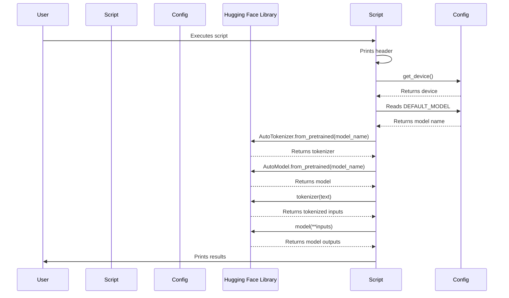
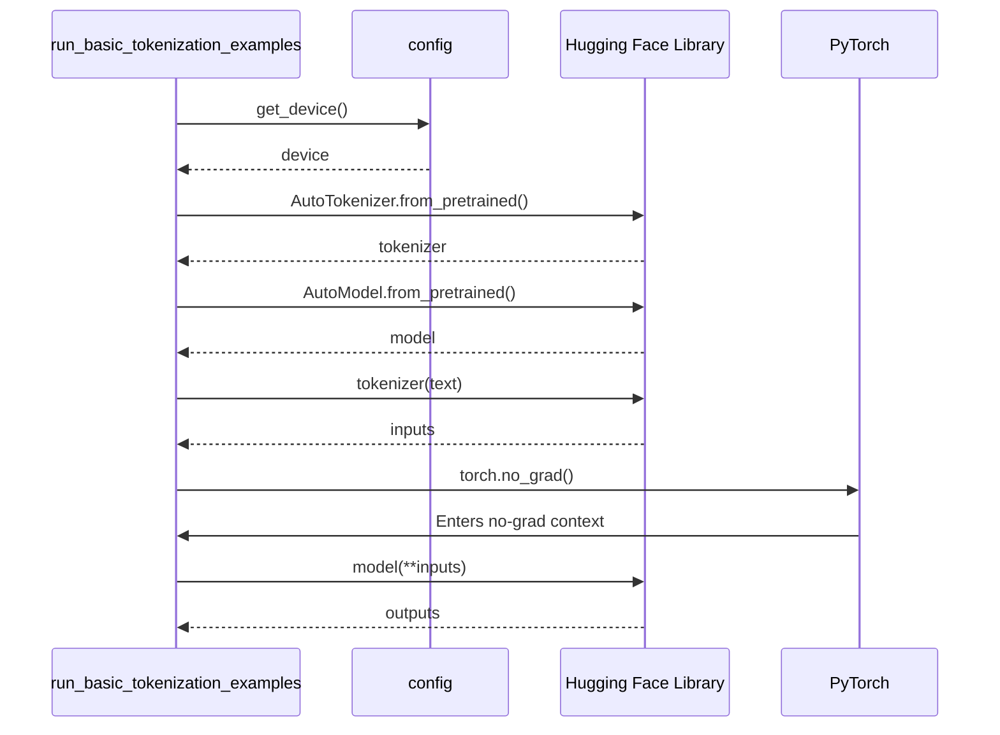

# Code Analysis for `src/basic_tokenization.py`

## 1. Top-level Overview

This script demonstrates a basic text tokenization process using the Hugging Face `transformers` library.

**Entry Point:**

The script's execution starts when it is run directly from the command line, which triggers the `if __name__ == "__main__":` block.

**High-Level Control Flow:**

1.  The script prints a header to the console.
2.  It calls the `run_basic_tokenization_examples()` function.
3.  Inside this function, it retrieves the processing device (CPU or GPU) using `get_device()` from the `config` module.
4.  It loads a pre-trained tokenizer and model from Hugging Face using the `DEFAULT_MODEL` name, also from `config`.
5.  A sample text string is defined.
6.  The tokenizer processes the text, converting it into a format suitable for the model (input IDs, padding, etc.).
7.  The script prints the original text, the generated tokens, and their corresponding IDs.
8.  The tokenized input is passed to the model.
9.  The script prints the shape of the model's output tensor.
10. A success message is printed upon completion.

## 2. Global Sequence Diagram



### Diagram Explanation

The diagram shows the sequence of operations when the user runs the script. The script first interacts with the `config.py` 
module to get configuration details like the device and model name. It then uses the Hugging Face `transformers` library 
to download and use a pre-trained tokenizer and model. Finally, it processes a sample text and prints the output for the user.

## 3. Function-by-Function Analysis

### `run_basic_tokenization_examples()`

-   **Purpose:** This function orchestrates the main logic of the script, demonstrating the tokenization of a sample sentence.
-   **Signature:**
    | Parameter | Type | Description |
    | :-------- | :--- | :---------- |
    | *None*    | -    | -           |
    **Returns:** `None`

-   **Context:** It is called only when the script is executed directly.
-   **Side effects:**
    -   Prints informational messages and results to the standard output.
    -   Performs network I/O to download the pre-trained model and tokenizer from Hugging Face if they are not already cached.
    -   Consumes memory to load the model.

-   **Code Listing and Explanation:**

```python
def run_basic_tokenization_examples():
    """Run basic tokenization examples."""
    
    print(f"Loading model: {DEFAULT_MODEL}")
    device = get_device()
    print(f"Using device: {device}")
```

This block starts by announcing which model is being loaded. It calls `get_device()` from the `config`module to determine whether to use a CPU or a GPU and prints the result.

```python
    # Example implementation
    tokenizer = AutoTokenizer.from_pretrained(DEFAULT_MODEL)
    model = AutoModel.from_pretrained(DEFAULT_MODEL)
```

Here, the script downloads and initializes the pre-trained tokenizer and model specified by `DEFAULT_MODEL`. The `AutoTokenizer` and `AutoModel` classes from the `transformers` library automatically select the correct classes for the chosen model.

```python
    # Example text
    text = "Hugging Face Transformers make NLP accessible to everyone!"
    
    # Tokenize
    inputs = tokenizer(text, return_tensors="pt", padding=True, truncation=True)
```

    A sample sentence is defined. The `tokenizer` is then called like a function to process this text.
    - `return_tensors="pt"`: Specifies that the output should be PyTorch tensors.
    - `padding=True`: Pads shorter sentences in a batch to the same length.
    - `truncation=True`: Truncates sentences that are longer than the model's maximum input size.

```python
    print(f"\nInput text: {text}")
    print(f"Tokens: {tokenizer.convert_ids_to_tokens(inputs['input_ids'][0].tolist())}")
    print(f"Token IDs: {inputs['input_ids'][0].tolist()}")
```

This block prints the results of the tokenization: the original text, the list of tokens (human-readable strings), and the list of token IDs (the numerical representation).

```python
    # Get model outputs
    with torch.no_grad():
        outputs = model(**inputs)
    
    print(f"\nModel output shape: {outputs.last_hidden_state.shape}")
    print("Example completed successfully!")
```

The tokenized `inputs` are passed to the `model`. `torch.no_grad()` is a context manager that disables gradient calculation, which is not needed for inference and saves memory and computation. The shape of the model's primary output (`last_hidden_state`) is printed to show the dimensionality of the result.

-   **Mini Sequence Diagram:**



-   **Diagram Explanation:** The function first gets configuration. It then uses the `transformers` library to create a tokenizer and a model. It tokenizes the input text and, within a `torch.no_grad()` context for efficiency, passes the tokens to the model to get the final output.

## 4. Architectural Mapping

-   **Layers:** This script is a single-layer, executable demonstration. It does not have a complex architectural structure. It acts as a client of the `transformers` library and the local `config` module.
-   **Interfaces:**
    -   `config.py`: Provides configuration values (`get_device`, `DEFAULT_MODEL`).
    -   `transformers`: Provides the core NLP functionality (tokenization, modeling).
-   **Cross-cutting Concerns:**
    -   **Configuration Management:** Externalized to `config.py`.
    -   **Logging:** Simple `print` statements are used for logging/output.

## 5. Diagram Generation

The relevant diagrams (Global Sequence Diagram and the function-level sequence diagram) are provided in the sections above. A class diagram is not applicable as the script is procedural.

