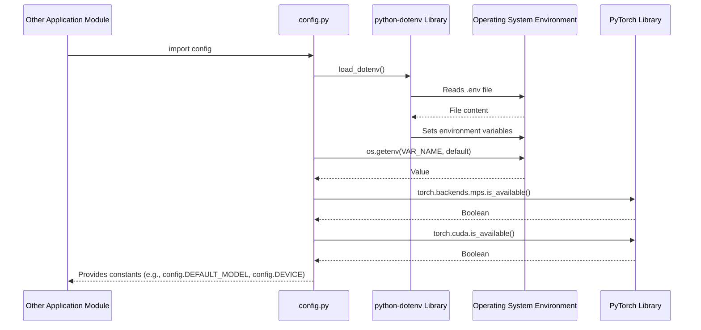

# Code Analysis for `src/config.py`

## 1. Top-level Overview

This module is responsible for managing the configuration of the application. It centralizes settings related to file paths, model parameters, API keys, and hardware device selection.

**Entry Point:**

This module is not intended to be run directly. It is imported by other scripts that need access to configuration constants and functions.

**High-Level Control Flow:**

1.  It loads environment variables from a `.env` file using `dotenv`.
2.  It defines several key directory paths (`PROJECT_ROOT`, `DATA_DIR`, `MODELS_DIR`) based on the location of this file.
3.  It ensures that the `DATA_DIR` and `MODELS_DIR` directories exist, creating them if necessary.
4.  It retrieves model-specific configurations (like the model name, batch size, and max length) from environment variables, providing default values if they are not set.
5.  It retrieves API keys from environment variables.
6.  It defines a function `get_device()` that checks for the availability of different PyTorch backends (MPS for Apple Silicon, CUDA for NVIDIA GPUs) and returns the best available device.
7.  It calls `get_device()` to set a global `DEVICE` constant.

## 2. Global Sequence Diagram

Since this is a configuration file, a traditional sequence diagram is less relevant. The primary interaction is other modules importing it to read its constants. Here is a conceptual diagram:



### Diagram Explanation

When another module imports `config.py`, the script is executed. It uses the `python-dotenv` library to load variables from a `.env` file into the operating system's environment. It then reads these environment variables to set Python constants. It also interacts with the PyTorch library to check for available hardware and determine the optimal device for computation. Finally, it exposes all the defined constants and functions to the importing module.

## 3. Function-by-Function Analysis

### `get_device()`

-   **Purpose:** To determine and return the most powerful computation device available to PyTorch.
-   **Signature:**
    | Parameter | Type | Description |
    | :-------- | :--- | :---------- |
    | *None*    | -    | -           |
    **Returns:** `str` - The name of the device (`"mps"`, `"cuda"`, or `"cpu"`).

-   **Context:** This function is called once at the module level to set the `DEVICE` constant. Other modules can also call it if they need to re-evaluate the device.
-   **Side effects:** None.

-   **Code Listing and Explanation:**

    ```python
    def get_device():
        """Get the best available device."""
        if torch.backends.mps.is_available():
            return "mps"
        elif torch.cuda.is_available():
            return "cuda"
        else:
            return "cpu"
    ```
    The function checks for hardware availability in a specific order of preference:
    1.  `torch.backends.mps.is_available()`: Checks for Apple's Metal Performance Shaders (MPS), available on modern Macs.
    2.  `torch.cuda.is_available()`: Checks for an NVIDIA GPU with CUDA support.
    3.  If neither is found, it defaults to `"cpu"`.

-   **Mini Sequence Diagram:**

    ```mermaid
    sequenceDiagram
        participant Func as get_device
        participant Torch as PyTorch

        Func->>Torch: torch.backends.mps.is_available()
        alt MPS is available
            Torch-->>Func: True
            Func-->>Caller: returns "mps"
        else MPS is not available
            Torch-->>Func: False
            Func->>Torch: torch.cuda.is_available()
            alt CUDA is available
                Torch-->>Func: True
                Func-->>Caller: returns "cuda"
            else CUDA is not available
                Torch-->>Func: False
                Func-->>Caller: returns "cpu"
            end
        end
    ```

-   **Diagram Explanation:** The diagram shows the conditional logic inside the function. It queries PyTorch for MPS support first. If that fails, it proceeds to check for CUDA support. If both checks fail, it returns "cpu" as the fallback.

## 4. Architectural Mapping

-   **Layers:** This module is a classic example of a cross-cutting concern, specifically **Configuration Management**. It provides services to all other layers of the application.
-   **Interfaces:** The module's public interface consists of the constants and functions it defines (e.g., `DEFAULT_MODEL`, `BATCH_SIZE`, `DEVICE`, `get_device()`).
-   **Cross-cutting Concerns:** This entire module is a cross-cutting concern.

## 5. Diagram Generation

A class diagram is not applicable. The most relevant diagrams are the sequence diagrams shown above.
