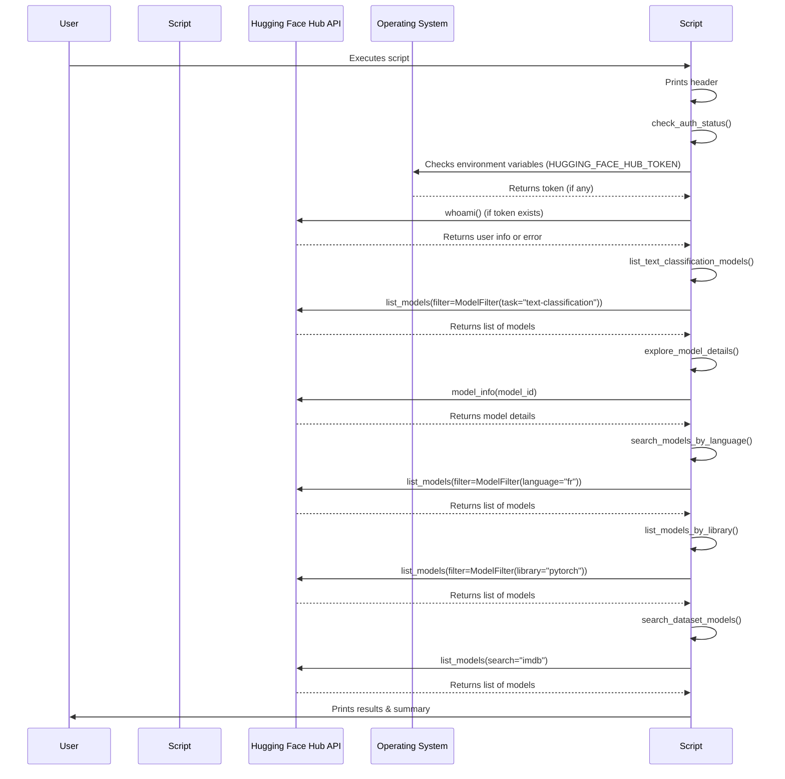

# Code Analysis for `src/hf_hub_example.py`

## 1. Top-level Overview

This script demonstrates how to interact with the Hugging Face Hub API to discover models, retrieve detailed model information, and search for models based on various criteria like task, language, library, and dataset. It also includes a check for the user's authentication status with the Hub.

**Entry Point:**

The script's execution starts when it is run directly from the command line, which triggers the `if __name__ == "__main__":` block.

**High-Level Control Flow:**

1.  The script prints a header.
2.  It first calls `check_auth_status()` to verify if the user is authenticated with the Hugging Face Hub.
3.  It then proceeds to demonstrate various Hub API functionalities:
    -   `list_text_classification_models()`: Lists and sorts models specifically for text classification by download count.
    -   `explore_model_details()`: Retrieves and displays detailed information for a specific model.
    -   `search_models_by_language()`: Searches for models based on language and task.
    -   `list_models_by_library()`: Lists models associated with a specific deep learning library (e.g., PyTorch).
    -   `search_dataset_models()`: Searches for models that have been trained on a particular dataset.
4.  A success message is printed upon completion.

## 2. Global Sequence Diagram

### Diagram Explanation

The diagram illustrates the overall flow of the script. After initialization, the script first attempts to verify authentication with the Hugging Face Hub. It then performs a series of queries to the Hugging Face Hub API to list, search, and retrieve detailed information about models based on various criteria.

## 3. Function-by-Function Analysis

### `list_text_classification_models()`

-   **Purpose:** Connects to the Hugging Face Hub API and lists models specifically categorized for 'text-classification'. It then sorts and displays the top 10 most downloaded models.
-   **Signature:**
    | Parameter | Type | Description |
    | :-------- | :--- | :---------- |
    | *None*    | -    | -           |
    **Returns:** `None`
-   **Context:** Called by `main()`.
-   **Side effects:** Prints model IDs, download counts, and likes to standard output. Performs network I/O to query the Hugging Face Hub.

### `explore_model_details()`

-   **Purpose:** Retrieves and displays comprehensive details for a specified model ID (e.g., `distilbert-base-uncased-finetuned-sst-2-english`), including author, downloads, likes, pipeline tag, license, and relevant tags.
-   **Signature:**
    | Parameter | Type | Description |
    | :-------- | :--- | :---------- |
    | *None*    | -    | -           |
    **Returns:** `None`
-   **Context:** Called by `main()`.
-   **Side effects:** Prints detailed model information to standard output. Performs network I/O to query the Hugging Face Hub.

### `search_models_by_language()`

-   **Purpose:** Demonstrates how to search for models based on a specific language (e.g., French) and task (e.g., text generation).
-   **Signature:**
    | Parameter | Type | Description |
    | :-------- | :--- | :---------- |
    | *None*    | -    | -           |
    **Returns:** `None`
-   **Context:** Called by `main()`.
-   **Side effects:** Prints a list of matching model IDs to standard output. Performs network I/O to query the Hugging Face Hub.

### `list_models_by_library()`

-   **Purpose:** Shows how to filter models by the deep learning library they are built with (e.g., PyTorch) and a specific task (e.g., translation).
-   **Signature:**
    | Parameter | Type | Description |
    | :-------- | :--- | :---------- |
    | *None*    | -    | -           |
    **Returns:** `None`
-   **Context:** Called by `main()`.
-   **Side effects:** Prints a list of matching model IDs and their download counts to standard output. Performs network I/O to query the Hugging Face Hub.

### `search_dataset_models()`

-   **Purpose:** Illustrates how to find models that have been trained or fine-tuned on a particular dataset (e.g., IMDB) for a specific task.
-   **Signature:**
    | Parameter | Type | Description |
    | :-------- | :--- | :---------- |
    | *None*    | -    | -           |
    **Returns:** `None`
-   **Context:** Called by `main()`.
-   **Side effects:** Prints a list of matching model IDs to standard output. Performs network I/O to query the Hugging Face Hub.

### `check_auth_status()`

-   **Purpose:** Verifies if the user is currently authenticated with the Hugging Face Hub by checking for an environment variable or an existing token and attempting to retrieve user information.
-   **Signature:**
    | Parameter | Type | Description |
    | :-------- | :--- | :---------- |
    | *None*    | -    | -           |
    **Returns:** `None`
-   **Context:** Called by `main()` at the beginning of the script.
-   **Side effects:** Prints the authentication status and user details (if authenticated) or instructions for authentication.

### `main()`

-   **Purpose:** The main function that orchestrates the execution of all Hugging Face Hub API examples.
-   **Signature:**
    | Parameter | Type | Description |
    | :-------- | :--- | :---------- |
    | *None*    | -    | -           |
    **Returns:** `None`
-   **Context:** Entry point of the script when executed directly.
-   **Side effects:** Calls other example functions, prints overall status.

## 4. Architectural Mapping

-   **Layers:** This script acts as an application layer, directly interacting with the `huggingface_hub` library to query the Hugging Face Hub API. It also interacts with the operating system to check environment variables.
-   **Interfaces:**
    -   `huggingface_hub`: Provides the `HfApi`, `ModelFilter`, `list_models`, and `model_info` functions for interacting with the Hub.
    -   `os`: Used for accessing environment variables to check for authentication tokens.
-   **Cross-cutting Concerns:**
    -   **Authentication:** Demonstrates how to check and utilize authentication tokens for Hub access.
    -   **Network I/O:** Heavily relies on network requests to the Hugging Face Hub.
    -   **Logging:** Simple `print` statements are used for output and progress indication.

## 5. Diagram Generation

The relevant diagrams (Global Sequence Diagram) are provided in the sections above. A class diagram is not applicable as the script is procedural.
