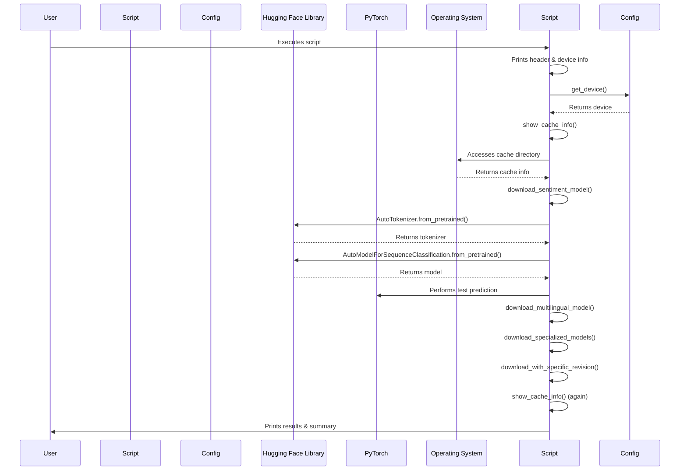

# Code Analysis for `src/model_download_example.py`

## 1. Top-level Overview

This script demonstrates various ways to download and manage Hugging Face models and tokenizers, highlighting caching mechanisms and specific download options.

**Entry Point:**

The script's execution starts when it is run directly from the command line, which triggers the `if __name__ == "__main__":` block.

**High-Level Control Flow:**

1.  The script prints a header and identifies the device (CPU, CUDA, or MPS) being used.
2.  It first calls `show_cache_info()` to display information about the Hugging Face model cache before any downloads.
3.  It then proceeds to download different types of models:
    -   `download_sentiment_model()`: Downloads a sentiment analysis model and tokenizer and performs a test prediction.
    -   `download_multilingual_model()`: Downloads a multilingual model and shows tokenization examples.
    -   `download_specialized_models()`: Downloads models for specific tasks like Question Answering and Named Entity Recognition.
    -   `download_with_specific_revision()`: Downloads a model with a specific revision (version).
4.  Finally, it calls `show_cache_info()` again to display the updated cache information after all downloads.
5.  A success message is printed upon completion.

## 2. Global Sequence Diagram

### Diagram Explanation

The diagram illustrates the overall flow of the script. After initialization and device detection, the script first checks the model cache. It then proceeds to download various types of models from the Hugging Face Hub, which are automatically cached locally. Finally, it re-checks the cache to show the impact of the downloads.

## 3. Function-by-Function Analysis

### `download_sentiment_model()`

-   **Purpose:** Downloads a pre-trained sentiment analysis model (`distilbert-base-uncased-finetuned-sst-2-english`) and its corresponding tokenizer. It also includes a small test prediction.
-   **Signature:**
    | Parameter | Type | Description |
    | :-------- | :--- | :---------- |
    | *None*    | -    | -           |
    **Returns:** `tuple` (model, tokenizer) - The downloaded model and tokenizer objects.
-   **Context:** Called by `main()`.
-   **Side effects:** Prints download progress and test prediction results. Performs network I/O to download the model/tokenizer if not cached.

### `download_multilingual_model()`

-   **Purpose:** Downloads a multilingual BERT model (`bert-base-multilingual-cased`) and its tokenizer, demonstrating its ability to handle multiple languages.
-   **Signature:**
    | Parameter | Type | Description |
    | :-------- | :--- | :---------- |
    | *None*    | -    | -           |
    **Returns:** `tuple` (model, tokenizer) - The downloaded model and tokenizer objects.
-   **Context:** Called by `main()`.
-   **Side effects:** Prints download progress and tokenization examples for different languages. Performs network I/O to download the model/tokenizer if not cached.

### `download_specialized_models()`

-   **Purpose:** Downloads models tailored for specific NLP tasks, such as Question Answering (`distilbert-base-cased-distilled-squad`) and Named Entity Recognition (`dslim/bert-base-NER`).
-   **Signature:**
    | Parameter | Type | Description |
    | :-------- | :--- | :---------- |
    | *None*    | -    | -           |
    **Returns:** `dict` - A dictionary containing the downloaded models and tokenizers, keyed by task type.
-   **Context:** Called by `main()`.
-   **Side effects:** Prints download status for each specialized model. Performs network I/O to download the models/tokenizers if not cached.

### `show_cache_info()`

-   **Purpose:** Displays information about the Hugging Face model cache directory, including its location, the number of cached models, and an estimated total size.
-   **Signature:**
    | Parameter | Type | Description |
    | :-------- | :--- | :---------- |
    | *None*    | -    | -           |
    **Returns:** `None`
-   **Context:** Called by `main()` at the beginning and end of the script.
-   **Side effects:** Prints cache information to standard output. Interacts with the operating system to list directories and get file sizes.

### `download_with_specific_revision()`

-   **Purpose:** Demonstrates how to download a specific version or revision of a model (e.g., `gpt2` from the `main` branch) from the Hugging Face Hub.
-   **Signature:**
    | Parameter | Type | Description |
    | :-------- | :--- | :---------- |
    | *None*    | -    | -           |
    **Returns:** `tuple` (model, tokenizer) - The downloaded model and tokenizer objects.
-   **Context:** Called by `main()`.
-   **Side effects:** Prints download status and model parameters. Performs network I/O to download the model/tokenizer if not cached.

### `main()`

-   **Purpose:** The main function that orchestrates the execution of all model download examples.
-   **Signature:**
    | Parameter | Type | Description |
    | :-------- | :--- | :---------- |
    | *None*    | -    | -           |
    **Returns:** `None`
-   **Context:** Entry point of the script when executed directly.
-   **Side effects:** Calls other example functions, prints overall status and device information.

## 4. Architectural Mapping

-   **Layers:** This script acts as an application layer, primarily interacting with the `transformers` library for model operations and the operating system for cache management. It also uses the local `config` module for environment settings.
-   **Interfaces:**
    -   `config.py`: Provides the `get_device()` function.
    -   `transformers`: Provides `AutoModel`, `AutoTokenizer`, and specialized `AutoModelFor*` classes for model downloading and loading.
    -   `os`: Used for interacting with the file system to inspect the cache directory.
-   **Cross-cutting Concerns:**
    -   **Configuration Management:** Device selection is externalized to `config.py`.
    -   **Caching:** Hugging Face models are automatically cached locally, and the script demonstrates how to inspect this cache.
    -   **Logging:** Simple `print` statements are used for output and progress indication.

## 5. Diagram Generation

The relevant diagrams (Global Sequence Diagram) are provided in the sections above. A class diagram is not applicable as the script is procedural.
