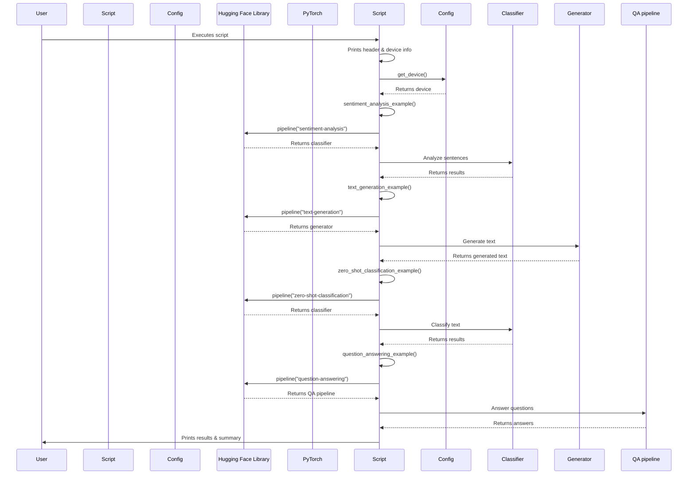

# Code Analysis for `src/pipeline_example.py`

## 1. Top-level Overview

This script demonstrates various common NLP tasks using the high-level `pipeline` abstraction from the Hugging Face `transformers` library. It covers sentiment analysis, text generation, zero-shot classification, and question answering.

**Entry Point:**

The script's execution starts when it is run directly from the command line, which triggers the `if __name__ == "__main__":` block.

**High-Level Control Flow:**

1.  The script prints a header and identifies the device (CPU, CUDA, or MPS) being used.
2.  It then calls functions to demonstrate different NLP pipelines:
    -   `sentiment_analysis_example()`: Analyzes the sentiment of given texts.
    -   `text_generation_example()`: Generates text based on provided prompts.
    -   `zero_shot_classification_example()`: Classifies text into categories without explicit training on those categories.
    -   `question_answering_example()`: Extracts answers to questions from a given context.
3.  A success message is printed upon completion.

## 2. Global Sequence Diagram

### Diagram Explanation

The diagram illustrates the overall flow of the script. After initialization and device detection, the script sequentially calls various functions, each demonstrating a different NLP task using the `pipeline` abstraction. Each pipeline is initialized and then used to process input data, with results printed to the console.

## 3. Function-by-Function Analysis

### `sentiment_analysis_example()`

-   **Purpose:** Demonstrates how to use the `sentiment-analysis` pipeline to determine the emotional tone (positive/negative) of input sentences.
-   **Signature:**
    | Parameter | Type | Description |
    | :-------- | :--- | :---------- |
    | *None*    | -    | -           |
    **Returns:** `None`
-   **Context:** Called by `main()`.
-   **Side effects:** Prints the sentiment label and confidence score for each input sentence. Performs network I/O to download the model if not cached.

### `text_generation_example()`

-   **Purpose:** Shows how to use the `text-generation` pipeline to generate new text based on a given prompt, using a model like `distilgpt2`.
-   **Signature:**
    | Parameter | Type | Description |
    | :-------- | :--- | :---------- |
    | *None*    | -    | -           |
    **Returns:** `None`
-   **Context:** Called by `main()`.
-   **Side effects:** Prints the generated text for each prompt. Performs network I/O to download the model if not cached.

### `zero_shot_classification_example()`

-   **Purpose:** Demonstrates the `zero-shot-classification` pipeline, which can classify text into categories even if the model hasn't been explicitly trained on those categories, by comparing the text to a list of candidate labels.
-   **Signature:**
    | Parameter | Type | Description |
    | :-------- | :--- | :---------- |
    | *None*    | -    | -           |
    **Returns:** `None`
-   **Context:** Called by `main()`.
-   **Side effects:** Prints the classification scores for each candidate label. Performs network I/O to download the model if not cached.

### `question_answering_example()`

-   **Purpose:** Illustrates the `question-answering` pipeline, which extracts answers to questions from a provided context text.
-   **Signature:**
    | Parameter | Type | Description |
    | :-------- | :--- | :---------- |
    | *None*    | -    | -           |
    **Returns:** `None`
-   **Context:** Called by `main()`.
-   **Side effects:** Prints the extracted answer and its confidence score for each question. Performs network I/O to download the model if not cached.

### `main()`

-   **Purpose:** The main function that orchestrates the execution of all pipeline examples.
-   **Signature:**
    | Parameter | Type | Description |
    | :-------- | :--- | :---------- |
    | *None*    | -    | -           |
    **Returns:** `None`
-   **Context:** Entry point of the script when executed directly.
-   **Side effects:** Calls other example functions, prints overall status and device information.

## 4. Architectural Mapping

-   **Layers:** This script acts as an application layer, primarily interacting with the `transformers` library's `pipeline` abstraction for various NLP tasks. It also uses the local `config` module for environment-specific settings.
-   **Interfaces:**
    -   `config.py`: Provides the `get_device()` function to determine the optimal processing device.
    -   `transformers`: Provides the `pipeline()` function, which abstracts away the complexities of model loading, tokenization, and inference for common NLP tasks.
-   **Cross-cutting Concerns:**
    -   **Configuration Management:** Device selection is externalized to `config.py`.
    -   **Logging:** Simple `print` statements are used for output and progress indication.
    -   **Model Caching:** Hugging Face models are automatically cached locally upon first download by the `pipeline` function.

## 5. Diagram Generation

The relevant diagrams (Global Sequence Diagram) are provided in the sections above. A class diagram is not applicable as the script is procedural.
