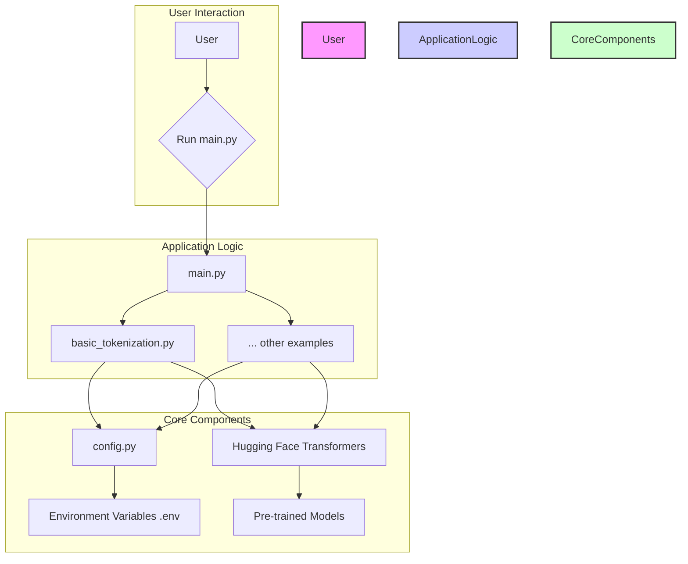
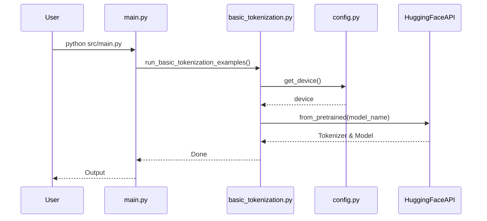
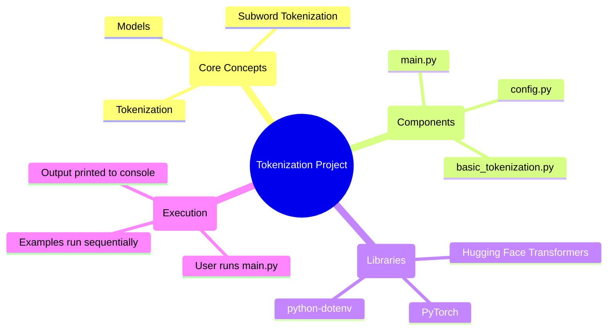

# Project-Level Code Analysis

This document provides a high-level overview of the entire `art_hug_03` project, including its structure, architecture, and key components.

## 1. Project Directory Tree

```
/Users/richardhightower/src/art_hug_03/
├───.env.example
├───.gitignore
├───.python-version
├───ch_03_project.yaml
├───pyproject.toml
├───README.md
├───Taskfile.yml
├───.claude/
│   └───settings.local.json
├───.idea/
│   ├───.gitignore
│   └───workspace.xml
├───.yamlproject/
│   └───config.yaml
├───src/
│   ├───__init__.py
│   ├───basic_tokenization.py
│   ├───config.py
│   └───main.py
└───tests/
    └───test_examples.py
```

-   **Root Directory**: Contains project configuration files like `.gitignore`, `pyproject.toml` (for Python project metadata and dependencies), and `Taskfile.yml` (for task automation). The `.env.example` file shows what environment variables are needed.
-   **`.idea/`, `.claude/`, `.yamlproject/`**: These are IDE-specific or tool-specific configuration directories.
-   **`src/`**: This is the main source code directory, containing the Python scripts that demonstrate tokenization examples.
-   **`tests/`**: This directory contains tests for the project.

## 2. Major Modules and Packages

| Module/Package | Description | Responsibilities & Purpose |
| :--- | :--- | :--- |
| `src/` | The main Python package for this project. | Contains all the executable code and logic for the tokenization examples. |
| `src/main.py` | The main entry point for the application. | Orchestrates the execution of all the different tokenization examples in a sequential manner. |
| `src/config.py` | Configuration module. | Manages all application settings, including paths, model configurations, API keys, and device selection (CPU/GPU). |
| `src/basic_tokenization.py` | Example script for basic tokenization. | Demonstrates how to use a Hugging Face tokenizer and model to convert text into tokens and generate model outputs. |

## 3. Project Architecture

### Architecture Diagram



### Diagram Description

The project has a simple, script-based architecture. The **User** initiates the process by executing the main script. The **Application Logic** layer, driven by `main.py`, controls the flow, calling various example scripts. These scripts rely on **Core Components**, which include the `config.py` module for settings and the Hugging Face `transformers` library for the actual NLP work. The configuration is loaded from environment variables, and the `transformers` library downloads pre-trained models.

## 4. Project-Level Diagrams

### Use Case Diagram

```mermaid
usecase "Run Tokenization Examples" as UC1
actor User

User --> UC1
```

-   **Actor:** The `User` is the primary actor who runs the scripts.
-   **Use Case:** The main use case is to `Run Tokenization Examples` to see how different tokenization strategies work.

### Sequence Diagram for the Whole Project

This diagram shows the high-level sequence of events when the user runs the project.



### Diagram Description

1.  The **User** executes `main.py`.
2.  `main.py` calls the function in `basic_tokenization.py`.
3.  `basic_tokenization.py` gets configuration from `config.py`.
4.  It then communicates with the **HuggingFaceAPI** to download the necessary model and tokenizer.
5.  Execution returns to `main.py`, which then prints output to the user.

### Mind Map



This mind map provides a visual summary of the project, showing the core concepts it demonstrates, the software components involved, the key libraries it depends on, and the overall execution flow.
