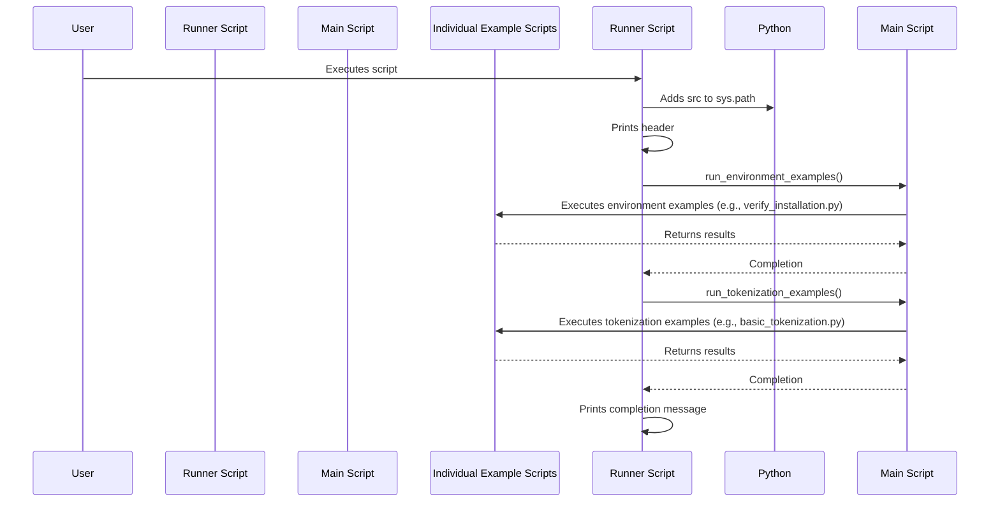

# Code Analysis for `src/run_all_examples.py`

## 1. Top-level Overview

This script serves as an automated runner for all the examples presented in Chapter 3 of the project. Its primary purpose is to execute all demonstration scripts sequentially without requiring user interaction, providing a quick way to verify the functionality of the entire chapter's code.

**Entry Point:**

The script's execution starts when it is run directly from the command line, which triggers the `if __name__ == "__main__":` block.

**High-Level Control Flow:**

1.  The script adds its parent directory (`src`) to the Python system path to ensure proper module imports.
2.  It prints a header indicating the start of Chapter 3 examples.
3.  It calls `run_environment_examples()` from `main.py` to execute environment-related demonstrations.
4.  It calls `run_tokenization_examples()` from `main.py` to execute all tokenization-related demonstrations.
5.  Finally, it prints a completion message.

## 2. Global Sequence Diagram



### Diagram Explanation

The diagram illustrates how `run_all_examples.py` orchestrates the execution of other example functions defined in `main.py`. It acts as a high-level controller, ensuring that all demonstrations are run in a predefined order, and relies on `main.py` to dispatch calls to the individual example scripts.

## 3. Function-by-Function Analysis

### `main()`

-   **Purpose:** The main function that orchestrates the execution of all Chapter 3 examples. It imports necessary functions from `main.py` and calls them sequentially.
-   **Signature:**
    | Parameter | Type | Description |
    | :-------- | :--- | :---------- |
    | *None*    | -    | -           |
    **Returns:** `None`
-   **Context:** Entry point of the script when executed directly.
-   **Side effects:**
    -   Modifies `sys.path` to include the `src` directory.
    -   Prints various informational messages to standard output.
    -   Triggers the execution of all example functions defined in `main.py`, which in turn may perform network I/O (model downloads), file operations, and print their own outputs.

-   **Code Listing and Explanation:**

```python
import sys
from pathlib import Path

# Add src to path
sys.path.append(str(Path(__file__).parent))

from main import print_section, run_environment_examples, run_tokenization_examples

def main():
    """Run all examples automatically."""
    print_section("CHAPTER 03: SETTING UP YOUR HUGGING FACE ENVIRONMENT")
    print("Running all examples automatically...\n")
    
    # Run environment examples
    run_environment_examples()
    
    # Run tokenization examples  
    run_tokenization_examples()
    
    print_section("ALL EXAMPLES COMPLETED")
    print("✅ Successfully ran all Chapter 3 examples!")

if __name__ == "__main__":
    main()
```

This code block first ensures that the `src` directory is in the Python path, allowing for relative imports. It then imports `print_section`, `run_environment_examples`, and `run_tokenization_examples` from `main.py`. The `main` function then sequentially calls these functions, wrapping their execution with informative print statements.

## 4. Architectural Mapping

-   **Layers:** This script acts as a top-level orchestration layer for the project's examples. It sits above `main.py`, which itself acts as an orchestrator for individual example scripts (e.g., `verify_installation.py`, `basic_tokenization.py`).
-   **Interfaces:**
    -   `main.py`: Provides the `print_section`, `run_environment_examples`, and `run_tokenization_examples` functions.
    -   `sys`: Used for modifying the Python import path.
    -   `pathlib`: Used for path manipulation.
-   **Cross-cutting Concerns:**
    -   **Automation:** Provides a fully automated way to run all examples.
    -   **Testing/Verification:** Can be used as a quick smoke test to ensure all examples run without errors.
    -   **Logging:** Uses `print` statements for progress and completion messages.

## 5. Diagram Generation

The relevant diagrams (Global Sequence Diagram) are provided in the sections above. A class diagram is not applicable as the script is procedural.

```