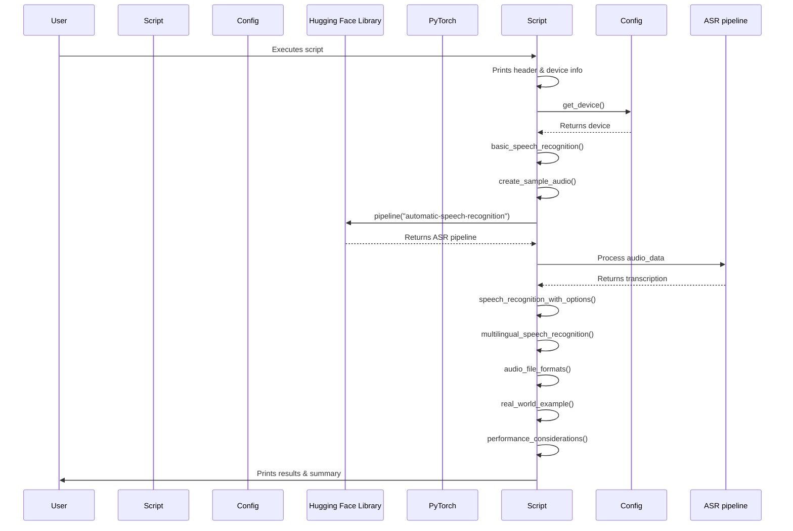

# Code Analysis for `src/speech_recognition_example.py`

## 1. Top-level Overview

This script demonstrates various aspects of Automatic Speech Recognition (ASR) using the Hugging Face `transformers` library. It covers basic ASR, options for processing, multilingual recognition, supported audio formats, real-world usage, and performance considerations.

**Entry Point:**

The script's execution starts when it is run directly from the command line, which triggers the `if __name__ == "__main__":` block.

**High-Level Control Flow:**

1.  The script prints a header and identifies the device (CPU, CUDA, or MPS) being used.
2.  It calls `basic_speech_recognition()` to demonstrate a simple ASR task with synthetic audio.
3.  It calls `speech_recognition_with_options()` to show how to use chunking and stride for processing longer audio.
4.  `multilingual_speech_recognition()` highlights the capability of multilingual ASR models.
5.  `audio_file_formats()` lists the various audio formats supported by Hugging Face pipelines.
6.  `real_world_example()` provides a code snippet for practical ASR usage with actual audio files.
7.  `performance_considerations()` discusses factors affecting ASR performance, such as model size, device, memory, batching, and audio quality.
8.  A success message is printed upon completion.

## 2. Global Sequence Diagram

### Diagram Explanation

The diagram illustrates the overall flow of the script. After initialization and device detection, the script sequentially calls various functions, each demonstrating a different aspect of speech recognition. These functions interact with the `config` module for device information and extensively use the Hugging Face `transformers` library to create and utilize ASR pipelines.

## 3. Function-by-Function Analysis

### `create_sample_audio()`

-   **Purpose:** Generates a synthetic sine wave audio sample for demonstration and testing purposes.
-   **Signature:**
    | Parameter | Type | Description |
    | :-------- | :--- | :---------- |
    | *None*    | -    | -           |
    **Returns:** `tuple` (numpy.ndarray, int) - A tuple containing the audio data as a NumPy array and the sample rate.
-   **Context:** Called by `basic_speech_recognition()` and `speech_recognition_with_options()`.
-   **Side effects:** Prints messages to standard output about the creation of the sample audio.

### `basic_speech_recognition()`

-   **Purpose:** Demonstrates a fundamental speech recognition task using a pre-trained `wav2vec2` model.
-   **Signature:**
    | Parameter | Type | Description |
    | :-------- | :--- | :---------- |
    | *None*    | -    | -           |
    **Returns:** `None`
-   **Context:** Called by `main()`.
-   **Side effects:** Prints the transcription result to standard output. Performs network I/O to download the model if not cached.

### `speech_recognition_with_options()`

-   **Purpose:** Shows how to configure the ASR pipeline with options like `chunk_length_s` and `stride_length_s` for processing longer audio segments.
-   **Signature:**
    | Parameter | Type | Description |
    | :-------- | :--- | :---------- |
    | *None*    | -    | -           |
    **Returns:** `None`
-   **Context:** Called by `main()`.
-   **Side effects:** Prints transcription results for different chunk lengths. Performs network I/O to download the model if not cached.

### `multilingual_speech_recognition()`

-   **Purpose:** Illustrates the concept of multilingual speech recognition models, though it doesn't perform an actual transcription due to the synthetic audio.
-   **Signature:**
    | Parameter | Type | Description |
    | :-------- | :--- | :---------- |
    | *None*    | -    | -           |
    **Returns:** `None`
-   **Context:** Called by `main()`.
-   **Side effects:** Prints information about a multilingual ASR model and its supported languages.

### `audio_file_formats()`

-   **Purpose:** Informs the user about the various audio file formats supported by Hugging Face ASR pipelines.
-   **Signature:**
    | Parameter | Type | Description |
    | :-------- | :--- | :---------- |
    | *None*    | -    | -           |
    **Returns:** `None`
-   **Context:** Called by `main()`.
-   **Side effects:** Prints a list of supported audio formats and example usage.

### `real_world_example()`

-   **Purpose:** Provides a concrete code example of how to use the ASR pipeline with real audio files, including batch processing.
-   **Signature:**
    | Parameter | Type | Description |
    | :-------- | :--- | :---------- |
    | *None*    | -    | -           |
    **Returns:** `None`
-   **Context:** Called by `main()`.
-   **Side effects:** Prints the example code snippet to standard output.

### `performance_considerations()`

-   **Purpose:** Discusses key factors that influence the performance of ASR models, such as model size, processing device, memory usage, batch processing, and audio quality.
-   **Signature:**
    | Parameter | Type | Description |
    | :-------- | :--- | :---------- |
    | *None*    | -    | -           |
    **Returns:** `None`
-   **Context:** Called by `main()`.
-   **Side effects:** Prints performance tips and considerations to standard output.

### `main()`

-   **Purpose:** The main function that orchestrates the execution of all speech recognition examples.
-   **Signature:**
    | Parameter | Type | Description |
    | :-------- | :--- | :---------- |
    | *None*    | -    | -           |
    **Returns:** `None`
-   **Context:** Entry point of the script when executed directly.
-   **Side effects:** Calls other example functions, prints overall status and device information.

## 4. Architectural Mapping

-   **Layers:** This script acts as an application layer, utilizing the `transformers` library as its core dependency for ASR functionalities. It also interacts with a local `config` module for environment-specific settings.
-   **Interfaces:**
    -   `config.py`: Provides the `get_device()` function to determine the optimal processing device.
    -   `transformers`: Provides the `pipeline()` function for ASR, and underlying models/tokenizers.
-   **Cross-cutting Concerns:**
    -   **Configuration Management:** Device selection is externalized to `config.py`.
    -   **Logging:** Simple `print` statements are used for output and progress indication.
    -   **Error Handling:** Basic `try-except` blocks are used for handling expected errors with synthetic audio.

## 5. Diagram Generation

The relevant diagrams (Global Sequence Diagram) are provided in the sections above. A class diagram is not applicable as the script is procedural.
