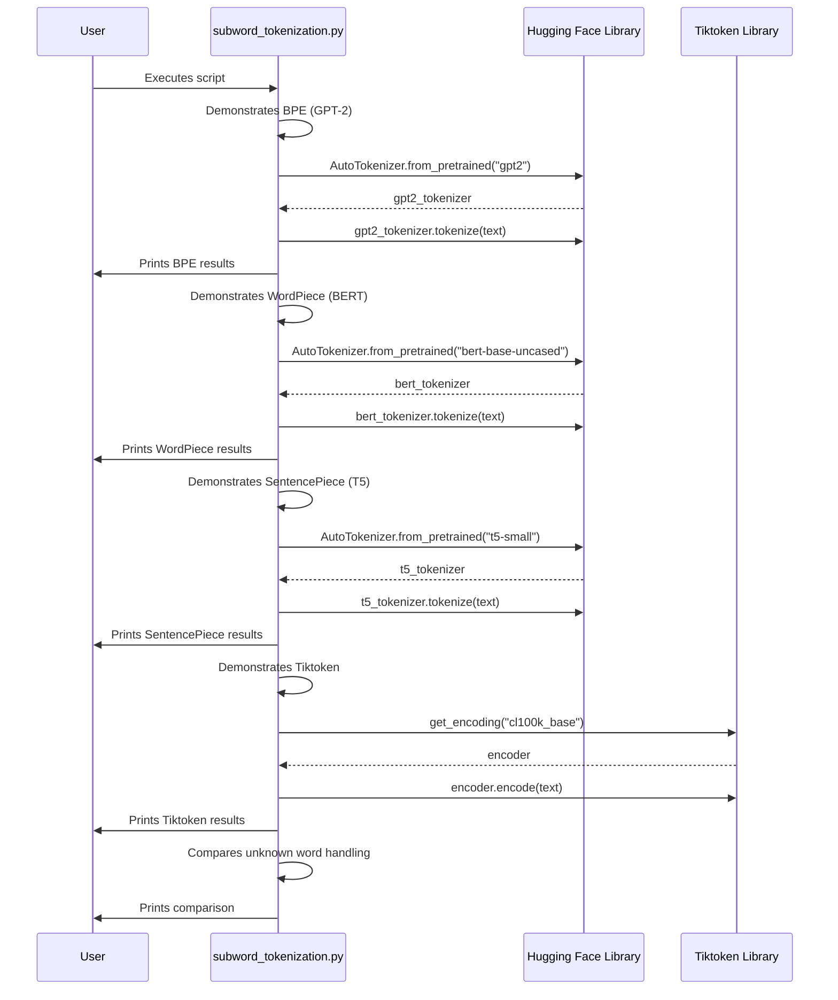

# Code Analysis for `src/subword_tokenization.py`

## 1. Top-level Overview

This script is a practical guide to the most common subword tokenization algorithms used in modern NLP. It demonstrates how different methods—BPE, WordPiece, and SentencePiece—break down the same piece of text, and it also includes OpenAI's `tiktoken` for comparison. The goal is to make the differences between these algorithms tangible.

**Entry Point:**

The script is designed to be run directly. The `if __name__ == "__main__":` block calls the `run_subword_tokenization_examples()` function, which contains all the logic.

**High-Level Control Flow:**

The script follows a clear, sequential path:
1.  It defines a sample text that will be used for comparison across all tokenizers.
2.  It demonstrates **BPE (Byte Pair Encoding)** by loading and using the `gpt2` tokenizer.
3.  It demonstrates **WordPiece** by loading and using the `bert-base-uncased` tokenizer.
4.  It demonstrates **SentencePiece** by loading and using the `t5-small` tokenizer.
5.  It demonstrates the tokenizer used by GPT-3.5/4 via the **`tiktoken`** library.
6.  For each of the above, it prints the resulting tokens, the token count, and the first few token IDs.
7.  Finally, it includes a specific section on how these different tokenizers handle a very rare, long word to illustrate the power of subword tokenization in avoiding "unknown token" issues.

## 2. Global Sequence Diagram

### Diagram Explanation

The user runs the script. The script then proceeds through a series of four demonstrations. In each of the first three, it requests a specific pre-trained tokenizer from the Hugging Face `transformers` library, uses it to tokenize a sample text, and prints the output. For the fourth demonstration, it uses the `tiktoken` library to perform the tokenization. Finally, it runs a special comparison on a rare word and prints the results for all tokenizers.

## 3. Function-by-Function Analysis

### `run_subword_tokenization_examples()`

-   **Purpose:** To execute a series of demonstrations that highlight the differences between major subword tokenization algorithms.
-   **Signature:** No parameters, returns `None`.
-   **Context:** This is the only function in the script and contains all the demonstration logic.
-   **Side effects:**
    -   Prints detailed explanations and results to the standard output.
    -   Performs network I/O to download the tokenizers from Hugging Face if they are not already cached.

-   **Code Listing and Explanation (by section):**

    **1. BPE (Byte Pair Encoding) - GPT-2:**
    This section loads the `gpt2` tokenizer, which uses BPE. BPE starts with characters and iteratively merges the most frequent pair of tokens. Notice the `Ġ` character in the output, which represents a space, indicating the start of a new word.

    **2. WordPiece - BERT:**
    This section uses the `bert-base-uncased` tokenizer. WordPiece is similar to BPE, but it merges pairs that maximize the likelihood of the training data. A key difference is that it marks subwords that are *inside* a word with a `##` prefix, rather than marking the start of a word.

    **3. SentencePiece - T5:**
    Here, the `t5-small` tokenizer is used. SentencePiece is unique because it treats the text as a raw stream of characters (including spaces) and tokenizes it directly. The ` ` character (a special underscore) is used to represent a space in the vocabulary.

    **4. Tiktoken - GPT-3.5/4:**
    This section uses OpenAI's `tiktoken` library, which is a highly optimized BPE implementation. It's known for its speed and is the standard for use with OpenAI's latest models.

    **5. Handling Unknown Words:**
    This is a crucial demonstration. It takes a very long, made-up word (`Supercalifragilisticexpialidocious`) and shows how each tokenizer breaks it down into smaller, known subword units. This is the core strength of subword tokenization: it can handle any word without ever needing a special `<UNK>` (unknown) token, because at worst it can just break the word down into individual characters.

## 4. Architectural Mapping

-   **Layers:** This is a single-layer, executable script for demonstration. It acts as a client to the `transformers` and `tiktoken` libraries.
-   **Interfaces:**
    -   `transformers.AutoTokenizer`: Its primary interface for loading Hugging Face tokenizers.
    -   `tiktoken.get_encoding`: Its interface for getting a `tiktoken` encoder.
-   **Cross-cutting Concerns:**
    -   **Configuration:** It imports `get_device` from `config.py` but does not use it.
    -   **Logging/Output:** All output is handled with `print` statements.

## 5. Diagram Generation

The most relevant diagrams are provided above. A class diagram is not applicable.
