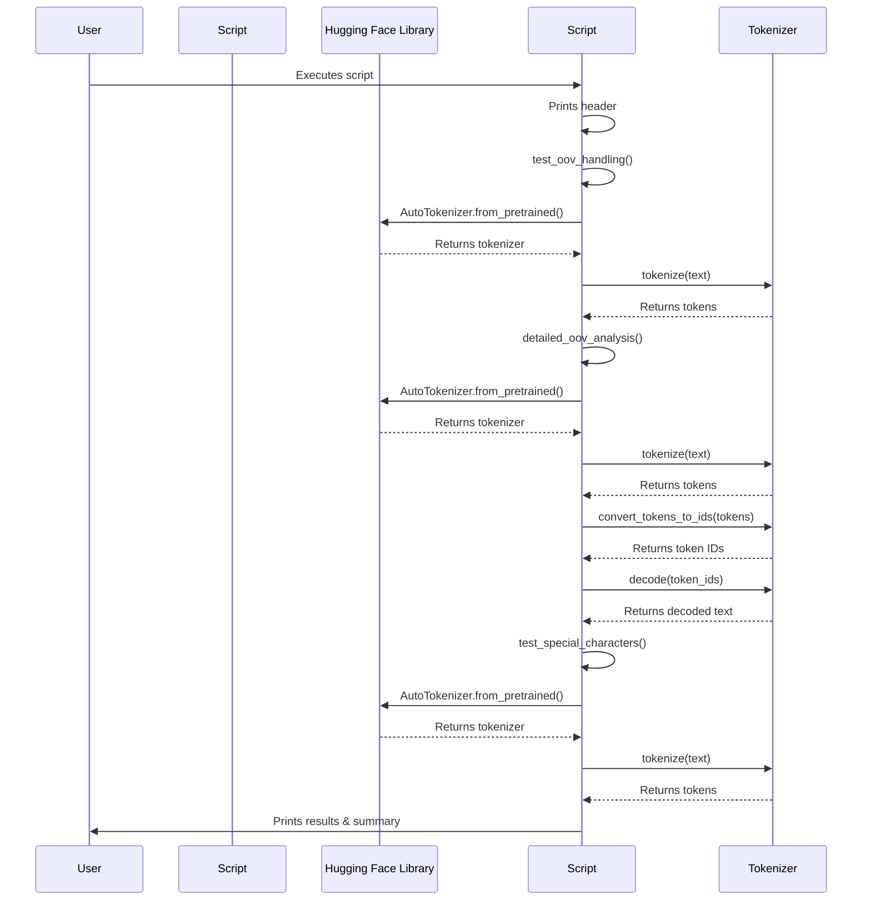

# Code Analysis for `src/test_oov_handling.py`

## 1. Top-level Overview

This script is designed to test and demonstrate how different Hugging Face tokenizers handle out-of-vocabulary (OOV) words, special characters, and emojis. It showcases the behavior of various tokenization algorithms (like WordPiece and BPE) when encountering tokens not present in their pre-trained vocabulary.

**Entry Point:**

The script's execution starts when it is run directly from the command line, which triggers the `if __name__ == "__main__":` block.

**High-Level Control Flow:**

1.  The script prints a header indicating the start of OOV handling tests.
2.  It calls `test_oov_handling()` to demonstrate basic OOV behavior across different models (BERT, GPT-2, RoBERTa) using made-up words.
3.  It calls `detailed_oov_analysis()` for a more in-depth look at how a specific OOV word is broken down into subwords and how unknown token IDs are handled.
4.  It calls `test_special_characters()` to examine how tokenizers process special characters and emojis.
5.  Finally, it prints a completion message.

## 2. Global Sequence Diagram

### Diagram Explanation

The diagram illustrates the sequential execution of OOV tests. The script initializes different tokenizers from the Hugging Face `transformers` library and then uses them to tokenize various test texts, including those with OOV words, special characters, and emojis. It then prints the tokenization results, including the presence of unknown tokens and the decoded text.

## 3. Function-by-Function Analysis

### `test_oov_handling()`

-   **Purpose:** Tests how different pre-trained tokenizers (`bert-base-uncased`, `gpt2`, `roberta-base`) handle made-up, out-of-vocabulary words. It identifies and reports the presence of unknown tokens.
-   **Signature:**
    | Parameter | Type | Description |
    | :-------- | :--- | :---------- |
    | *None*    | -    | -           |
    **Returns:** `None`
-   **Context:** Called by `main()`.
-   **Side effects:** Prints the tokenizer name, its UNK token, the tokenized output, and a warning if UNK tokens are found.

### `detailed_oov_analysis()`

-   **Purpose:** Provides a more in-depth analysis of OOV handling for a specific long, made-up word. It shows the tokens, their corresponding IDs, and the result of decoding the tokens back to text, demonstrating subword tokenization.
-   **Signature:**
    | Parameter | Type | Description |
    | :-------- | :--- | :---------- |
    | *None*    | -    | -           |
    **Returns:** `None`
-   **Context:** Called by `main()`.
-   **Side effects:** Prints the tokenizer type, tokens, token IDs, and decoded text, highlighting unknown token IDs if present.

### `test_special_characters()`

-   **Purpose:** Examines how a tokenizer (`bert-base-uncased`) processes various special characters and emojis, checking if they are tokenized correctly or result in unknown tokens.
-   **Signature:**
    | Parameter | Type | Description |
    | :-------- | :--- | :---------- |
    | *None*    | -    | -           |
    **Returns:** `None`
-   **Context:** Called by `main()`.
-   **Side effects:** Prints the original text, its tokens, token count, and a warning if unknown tokens are found.

### `main()`

-   **Purpose:** The main function that orchestrates the execution of all OOV handling tests.
-   **Signature:**
    | Parameter | Type | Description |
    | :-------- | :--- | :---------- |
    | *None*    | -    | -           |
    **Returns:** `None`
-   **Context:** Entry point of the script when executed directly.
-   **Side effects:** Calls other test functions and prints overall status messages.

## 4. Architectural Mapping

-   **Layers:** This script operates as a testing and demonstration layer, directly interacting with the `transformers` library's `AutoTokenizer` to explore its behavior under specific conditions.
-   **Interfaces:**
    -   `transformers`: Provides the `AutoTokenizer` class for loading and using different tokenizers.
-   **Cross-cutting Concerns:**
    -   **Tokenization Behavior:** Focuses specifically on how tokenizers handle words and characters not explicitly in their vocabulary.
    -   **Debugging/Understanding:** Helps in understanding the nuances of different tokenization algorithms.
    -   **Logging:** Uses `print` statements to display test results and observations.

## 5. Diagram Generation

The relevant diagrams (Global Sequence Diagram) are provided in the sections above. A class diagram is not applicable as the script is procedural.
