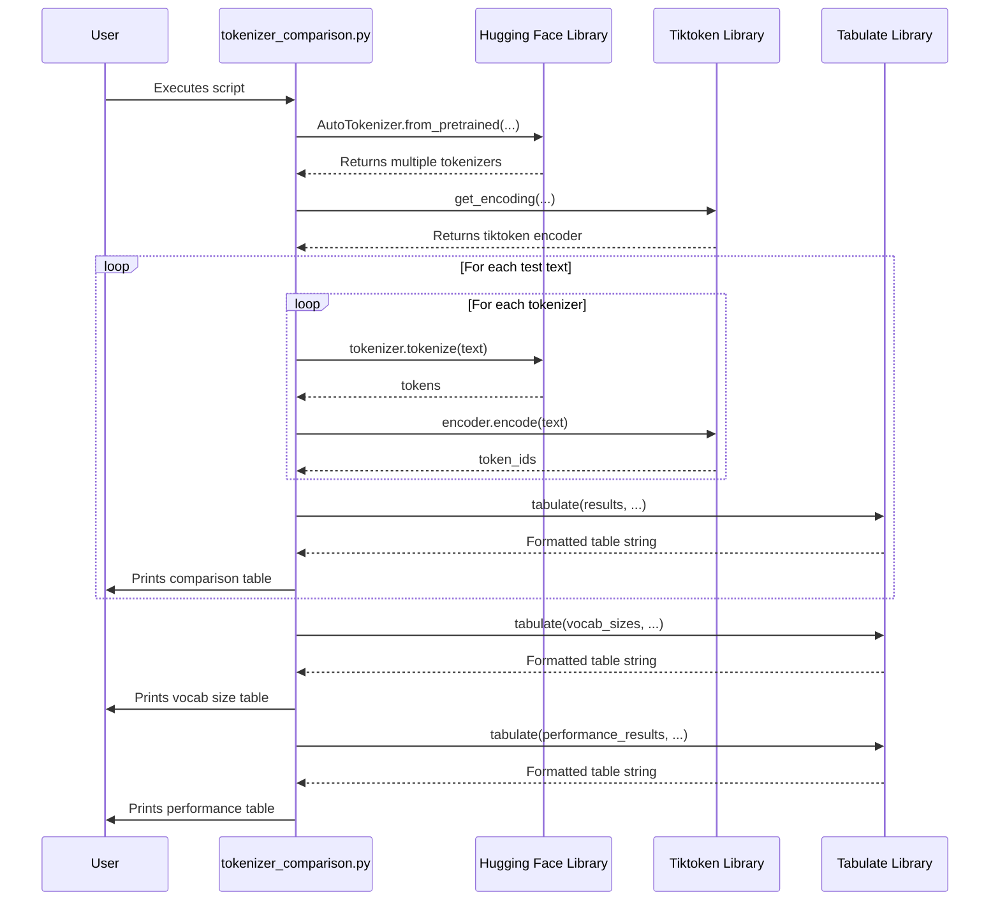

# Code Analysis for `src/tokenizer_comparison.py`

## 1. Top-level Overview

This script is designed to compare and contrast several popular tokenization algorithms from the Hugging Face ecosystem and OpenAI's `tiktoken`. It systematically evaluates how different tokenizers handle various types of text, and it also compares them on metrics like vocabulary size and encoding speed.

**Entry Point:**

The script is executed directly from the command line, which triggers the `if __name__ == "__main__":` block, calling the `run_tokenizer_comparison_examples()` function.

**High-Level Control Flow:**

1.  The script initializes a set of tokenizers from Hugging Face (`BERT`, `GPT-2`, `T5`, `RoBERTa`) and a `tiktoken` encoder.
2.  It defines a dictionary of diverse test texts, including simple sentences, technical jargon, multilingual content, code, and more.
3.  It iterates through each test text:
    -   For each text, it processes it with every tokenizer.
    -   It collects the token count, the first few tokens, and the first few token IDs.
    -   It formats and prints these results in a table using the `tabulate` library.
4.  After analyzing the texts, it compares the tokenizers on several key characteristics:
    -   **Vocabulary Size:** It prints a table showing the total number of unique tokens each tokenizer knows.
    -   **Performance:** It measures and tabulates the time each tokenizer takes to encode a long text 100 times.
    -   **Special Tokens:** It identifies and lists the special control tokens (like `[CLS]`, `[SEP]`) used by each tokenizer.
5.  The script prints a completion message.

## 2. Global Sequence Diagram



### Diagram Explanation

The user runs the script. The script first initializes all the necessary tokenizers by calling the Hugging Face and `tiktoken` libraries. It then enters a main loop where it processes a series of test texts. Inside this loop, it calls each tokenizer to get the tokenization results. The `tabulate` library is used to format these results into a clean, readable grid, which is then printed to the user. This process is repeated for vocabulary size and performance comparisons.

## 3. Function-by-Function Analysis

### `run_tokenizer_comparison_examples()`

-   **Purpose:** To orchestrate the entire comparison of different tokenizers across various dimensions.
-   **Signature:** No parameters, returns `None`.
-   **Context:** This is the main and only function in the script, called when the script is executed.
-   **Side effects:**
    -   Prints extensively to the standard output.
    -   Performs network I/O to download pre-trained tokenizers from Hugging Face if they are not cached.
    -   Consumes memory to load the tokenizers.

-   **Code Listing and Explanation:**

    The function is monolithic, so we will break down its logical sections.

    **Initialization:**
    ```python
    tokenizers = {
        "BERT (WordPiece)": AutoTokenizer.from_pretrained("bert-base-uncased"),
        "GPT-2 (BPE)": AutoTokenizer.from_pretrained("gpt2"),
        "T5 (SentencePiece)": AutoTokenizer.from_pretrained("t5-small"),
        "RoBERTa (BPE)": AutoTokenizer.from_pretrained("roberta-base"),
    }
    tiktoken_enc = tiktoken.get_encoding("cl100k_base")
    ```
    This block sets up the tokenizers that will be compared. It loads four different tokenizers from Hugging Face, each representing a different underlying algorithm (WordPiece, BPE, SentencePiece). It also initializes a `tiktoken` encoder, which is used by models like GPT-3.5 and GPT-4.

    **Text Comparison Loop:**
    ```python
    for text_name, text in test_texts.items():
        # ...
        for name, tokenizer in tokenizers.items():
            tokens = tokenizer.tokenize(text)
            token_ids = tokenizer.encode(text, add_special_tokens=False)
            # ...
        # ... (add tiktoken results)
        print(tabulate(results, headers=headers, tablefmt="grid"))
    ```
    This is the core logic of the script. It iterates through a predefined set of test cases. For each case, it tokenizes the text with every tokenizer, collects the results (token count and the tokens themselves), and then uses `tabulate` to print a nicely formatted comparison table.

    **Vocabulary Size Comparison:**
    ```python
    vocab_sizes = []
    for name, tokenizer in tokenizers.items():
        vocab_sizes.append([name, f"{tokenizer.vocab_size:,}"])
    # ... (add tiktoken results)
    print(tabulate(vocab_sizes, headers=["Tokenizer", "Vocabulary Size"], tablefmt="grid"))
    ```
    This section gathers the `vocab_size` attribute from each tokenizer, which indicates how many unique tokens are in its vocabulary. It then prints this information in a table.

    **Performance Comparison:**
    ```python
    long_text = " ".join(["This is a sample sentence for performance testing."] * 100)
    for name, tokenizer in tokenizers.items():
        start_time = time.time()
        for _ in range(100):
            _ = tokenizer.encode(long_text)
        elapsed = time.time() - start_time
        # ...
    # ... (add tiktoken results)
    print(tabulate(perf_results, headers=["Tokenizer", "Time (100 iterations)"], tablefmt="grid"))
    ```
    Here, the script measures the speed of each tokenizer. It creates a long string and then encodes it 100 times, measuring the total elapsed time. This provides a simple benchmark of encoding performance.

## 4. Architectural Mapping

-   **Layers:** This script is a single-layer, executable demonstration. It acts as a client to the `transformers`, `tiktoken`, and `tabulate` libraries.
-   **Interfaces:**
    -   `transformers.AutoTokenizer`: Used to load various pre-trained tokenizers.
    -   `tiktoken.get_encoding`: Used to get an encoder for OpenAI models.
    -   `tabulate.tabulate`: Used for formatting the output into tables.
-   **Cross-cutting Concerns:**
    -   **Logging/Output:** The script uses `print` and `tabulate` for all its output.

## 5. Diagram Generation

The most relevant diagrams are included above. A class diagram is not applicable.
