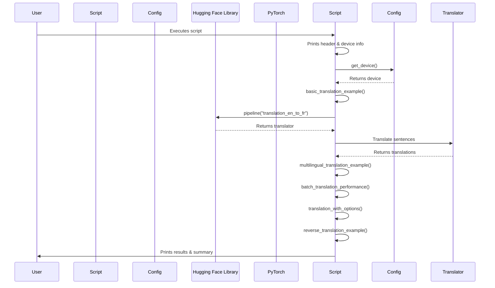

# Code Analysis for `src/translation_example.py`

## 1. Top-level Overview

This script demonstrates various aspects of machine translation using the Hugging Face `transformers` library. It covers basic translation, multilingual translation, performance comparison between single and batch translation, and translation with various options.

**Entry Point:**

The script's execution starts when it is run directly from the command line, which triggers the `if __name__ == "__main__":` block.

**High-Level Control Flow:**

1.  The script prints a header and identifies the device (CPU, CUDA, or MPS) being used.
2.  It calls `basic_translation_example()` to demonstrate a simple English to French translation.
3.  It calls `multilingual_translation_example()` to show translation between multiple language pairs.
4.  `batch_translation_performance()` compares the performance of single versus batch translation.
5.  `translation_with_options()` demonstrates how to use various options like `max_length` and `num_beams`.
6.  `reverse_translation_example()` shows a back-translation (round-trip translation) from English to French and back to English.
7.  A success message is printed upon completion.

## 2. Global Sequence Diagram

### Diagram Explanation

The diagram illustrates the overall flow of the script. After initialization and device detection, the script sequentially calls various functions, each demonstrating a different aspect of machine translation. These functions interact with the `config` module for device information and extensively use the Hugging Face `transformers` library to create and utilize translation pipelines.

## 3. Function-by-Function Analysis

### `basic_translation_example()`

-   **Purpose:** Demonstrates a basic English to French translation using a pre-trained `Helsinki-NLP/opus-mt-en-fr` model.
-   **Signature:**
    | Parameter | Type | Description |
    | :-------- | :--- | :---------- |
    | *None*    | -    | -           |
    **Returns:** `None`
-   **Context:** Called by `main()`.
-   **Side effects:** Prints original and translated sentences to standard output. Performs network I/O to download the model if not cached.

### `multilingual_translation_example()`

-   **Purpose:** Shows translation between multiple language pairs (English to German, Spanish, and Chinese) using different `Helsinki-NLP/opus-mt` models.
-   **Signature:**
    | Parameter | Type | Description |
    | :-------- | :--- | :---------- |
    | *None*    | -    | -           |
    **Returns:** `None`
-   **Context:** Called by `main()`.
-   **Side effects:** Prints original and translated text for each language pair. Performs network I/O to download models if not cached.

### `batch_translation_performance()`

-   **Purpose:** Compares the performance of translating sentences one by one versus translating them in a batch, highlighting the efficiency of batch processing.
-   **Signature:**
    | Parameter | Type | Description |
    | :-------- | :--- | :---------- |
    | *None*    | -    | -           |
    **Returns:** `None`
-   **Context:** Called by `main()`.
-   **Side effects:** Prints time taken for single and batch translations, and calculates the speedup.

### `translation_with_options()`

-   **Purpose:** Demonstrates how to use various translation options such as `max_length` to control output length and `num_beams` for generating multiple translation candidates.
-   **Signature:**
    | Parameter | Type | Description |
    | :-------- | :--- | :---------- |
    | *None*    | -    | -           |
    **Returns:** `None`
-   **Context:** Called by `main()`.
-   **Side effects:** Prints translated text with different options.

### `reverse_translation_example()`

-   **Purpose:** Illustrates back-translation (round-trip translation) by translating a sentence from English to French and then back to English to check for similarity.
-   **Signature:**
    | Parameter | Type | Description |
    | :-------- | :--- | :---------- |
    | *None*    | -    | -           |
    **Returns:** `None`
-   **Context:** Called by `main()`.
-   **Side effects:** Prints the original, translated, and back-translated sentences.

### `main()`

-   **Purpose:** The main function that orchestrates the execution of all translation examples.
-   **Signature:**
    | Parameter | Type | Description |
    | :-------- | :--- | :---------- |
    | *None*    | -    | -           |
    **Returns:** `None`
-   **Context:** Entry point of the script when executed directly.
-   **Side effects:** Calls other example functions, prints overall status and device information.

## 4. Architectural Mapping

-   **Layers:** This script acts as an application layer, utilizing the `transformers` library as its core dependency for translation functionalities. It also interacts with a local `config` module for environment-specific settings.
-   **Interfaces:**
    -   `config.py`: Provides the `get_device()` function to determine the optimal processing device.
    -   `transformers`: Provides the `pipeline()` function for translation, and underlying models/tokenizers.
-   **Cross-cutting Concerns:**
    -   **Configuration Management:** Device selection is externalized to `config.py`.
    -   **Logging:** Simple `print` statements are used for output and progress indication.
    -   **Performance Measurement:** Uses `time` module to measure execution time for performance comparison.

## 5. Diagram Generation

The relevant diagrams (Global Sequence Diagram) are provided in the sections above. A class diagram is not applicable as the script is procedural.
