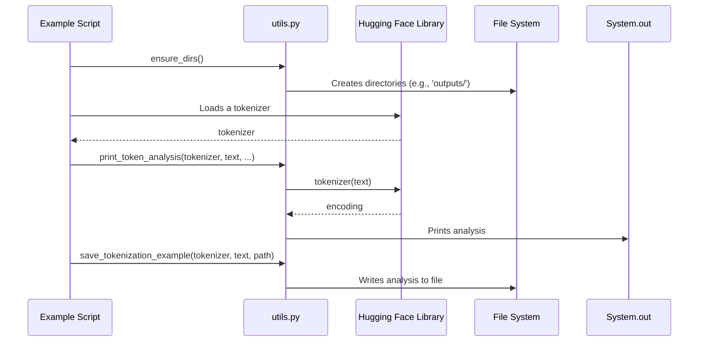

# Code Analysis for `src/utils.py`

## 1. Top-level Overview

This script provides a collection of utility functions designed to support the various tokenization example scripts. It centralizes common operations like creating directories, printing detailed token information, comparing different tokenizers, and saving results.

**Entry Point:**

This module is not intended to be executed directly. It is a library of functions to be imported and used by other scripts in the project.

**High-Level Control Flow:**

As a utility library, it doesn't have a single control flow. Other scripts import specific functions from this module and call them as needed to perform tasks such as:
- Ensuring the project's directory structure is in place.
- Printing formatted analysis of tokenization outputs.
- Comparing the behavior of multiple tokenizers on the same text.
- Saving tokenization results to files for inspection.

## 2. Global Sequence Diagram

This diagram illustrates how an example script would typically interact with the `utils.py` module.

### Diagram Explanation

The diagram shows a typical usage pattern. An `Example Script` first calls `ensure_dirs()` to set up the necessary folders. It then loads a tokenizer from the Hugging Face library. This tokenizer, along with some text, is passed to functions in `utils.py` like `print_token_analysis` or `save_tokenization_example`. The utility functions then use the tokenizer to process the text and either print the results to the console or save them to the file system.

## 3. Function-by-Function Analysis

### `ensure_dirs()`
- **Purpose:** To create the standard directories (`data`, `models`, `outputs`) used by the project if they do not already exist.
- **Signature:** No parameters, returns `None`.
- **Context:** Called at the beginning of scripts that might need to read from or write to these directories.
- **Side effects:** Creates directories on the file system.

### `print_token_analysis(tokenizer, text, name)`
- **Purpose:** To provide a detailed, printed breakdown of how a specific tokenizer processes a given string of text.
- **Signature:**
| Parameter | Type | Description |
| :--- | :--- | :--- |
| `tokenizer` | `PreTrainedTokenizer` | The Hugging Face tokenizer instance. |
| `text` | `str` | The input text to analyze. |
| `name` | `str` | An optional name for the tokenizer to be used in the printed output. |
- **Returns:** The `encoding` object from the tokenizer.
- **Context:** Used in example scripts to show the direct output of a tokenizer, including tokens, IDs, and masks.
- **Side effects:** Prints to standard output.

### `compare_tokenizations(tokenizers, text)`
- **Purpose:** To compare the tokenization results of multiple different tokenizers for the same input text.
- **Signature:**
| Parameter | Type | Description |
| :--- | :--- | :--- |
| `tokenizers` | `Dict[str, Any]` | A dictionary where keys are tokenizer names and values are tokenizer instances. |
| `text` | `str` | The input text to compare. |
- **Returns:** A dictionary containing the tokens and token counts for each tokenizer.
- **Context:** Used in scripts that are designed to highlight the differences between tokenizer algorithms (e.g., WordPiece vs. BPE).
- **Side effects:** Prints to standard output.

### `visualize_attention_mask(attention_mask, tokens)`
- **Purpose:** To print a simple, text-based visualization of an attention mask aligned with its corresponding tokens.
- **Signature:**
| Parameter | Type | Description |
| :--- | :--- | :--- |
| `attention_mask` | `torch.Tensor` | The attention mask tensor from the tokenizer output. |
| `tokens` | `List[str]` | The list of token strings. |
- **Returns:** `None`.
- **Context:** Used to visually explain the concept of an attention mask, showing which tokens the model should pay attention to.
- **Side effects:** Prints to standard output.

### `save_tokenization_example(tokenizer, text, output_path)`
- **Purpose:** To save the detailed output of a tokenization process to a text file.
- **Signature:**
| Parameter | Type | Description |
| :--- | :--- | :--- |
| `tokenizer` | `PreTrainedTokenizer` | The tokenizer instance. |
| `text` | `str` | The input text. |
| `output_path` | `str` | The file path to save the output to. |
- **Returns:** `None`.
- **Context:** Useful for capturing the output of a tokenization process for later analysis without having to re-run the script.
- **Side effects:** Writes to a file on the file system.

### `batch_tokenize_texts(tokenizer, texts, **kwargs)`
- **Purpose:** To tokenize a list of texts simultaneously in a batch, which is more efficient than tokenizing them one by one.
- **Signature:**
| Parameter | Type | Description |
| :--- | :--- | :--- |
| `tokenizer` | `PreTrainedTokenizer` | The tokenizer instance. |
| `texts` | `List[str]` | A list of text strings to tokenize. |
| `**kwargs` | | Additional arguments to pass to the tokenizer (e.g., `max_length`). |
- **Returns:** The `encodings` object for the entire batch.
- **Context:** Demonstrates the proper way to handle multiple inputs for a model, including padding and truncation.
- **Side effects:** Prints a summary of the batch tokenization to standard output.

### `demonstrate_special_tokens(tokenizer)`
- **Purpose:** To display all the special tokens (like `[CLS]`, `[SEP]`, `[PAD]`) that a particular tokenizer uses.
- **Signature:**
| Parameter | Type | Description |
| :--- | :--- | :--- |
| `tokenizer` | `PreTrainedTokenizer` | The tokenizer instance to inspect. |
- **Returns:** A dictionary of the special tokens found.
- **Context:** Helps in understanding the specific control tokens that a model architecture expects in its input.
- **Side effects:** Prints the found special tokens and their IDs to standard output.

## 4. Architectural Mapping

- **Layers:** This module is a classic example of a **Utility** or **Shared Services** layer. It is a cross-cutting concern that provides common, reusable functionality to other parts of the application (in this case, the example scripts).
- **Interfaces:** The public interface of this module is the set of all its functions. Scripts in the `src/` directory import and call these functions directly.
- **Cross-cutting Concerns:** This entire module is dedicated to the cross-cutting concern of providing reusable helper functions.

## 5. Diagram Generation

Relevant diagrams are included in the sections above. A class diagram is not applicable as the module is purely functional.
