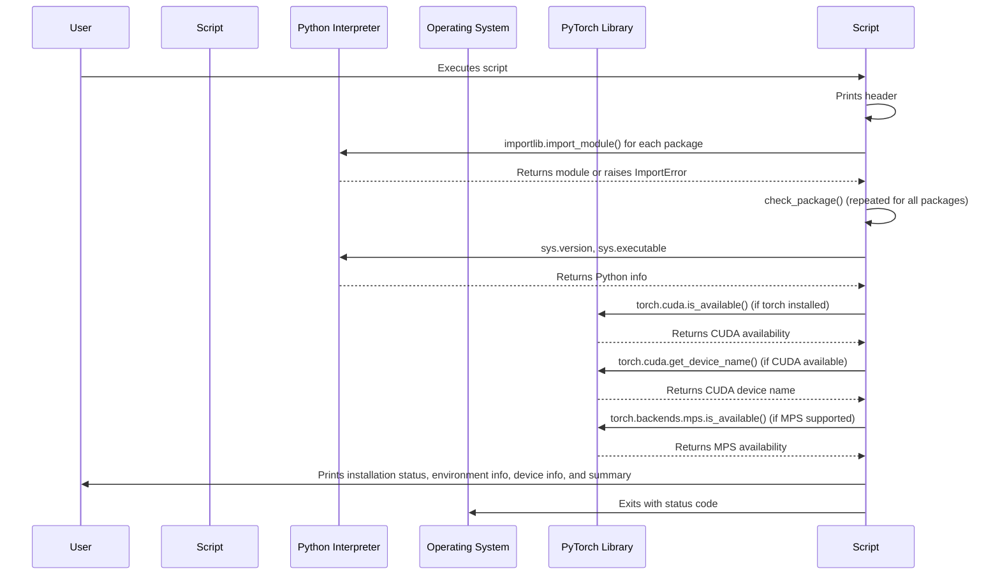

# Code Analysis for `src/verify_installation.py`

## 1. Top-level Overview

This script is designed to verify the correct installation and environment setup for Hugging Face libraries and their dependencies. It checks for the presence and version of key packages like `transformers`, `torch`, `huggingface_hub`, and others, and provides information about the Python environment and PyTorch device availability.

**Entry Point:**

The script's execution starts when it is run directly from the command line, which triggers the `if __name__ == "__main__":` block.

**High-Level Control Flow:**

1.  The script prints a header.
2.  It defines a list of core Hugging Face-related packages to check.
3.  It iterates through this list, calling `check_package()` for each to determine if it's installed and to retrieve its version.
4.  It prints the installation status and version for each package.
5.  It then prints information about the Python environment (version and executable path).
6.  If PyTorch is installed, it checks and prints information about CUDA and Apple Silicon MPS device availability.
7.  Finally, it provides a summary indicating whether all required packages are installed or if some are missing, along with a suggestion to run `task setup` if dependencies are not met.
8.  The script exits with a status code of 0 if all packages are installed, and 1 otherwise.

## 2. Global Sequence Diagram

### Diagram Explanation

The diagram illustrates the overall flow of the script. It starts by checking the installation status of various Python packages using `importlib`. It then gathers and displays information about the Python environment and, if PyTorch is present, checks for and reports on the availability of GPU acceleration (CUDA) and Apple Silicon's MPS. The script concludes with a summary of the installation status.

## 3. Function-by-Function Analysis

### `check_package(package_name: str) -> Tuple[bool, str]`

-   **Purpose:** A helper function that attempts to import a given Python package and retrieve its `__version__` attribute. It indicates whether the package is installed and, if so, its version.
-   **Signature:**
    | Parameter    | Type | Description |
    | :----------- | :--- | :---------- |
    | `package_name` | `str` | The name of the Python package to check (e.g., "transformers"). |
    **Returns:** `Tuple[bool, str]` - A tuple where the first element is `True` if the package is installed, `False` otherwise. The second element is the package's version string or "not installed".
-   **Context:** Called repeatedly by `main()` for each package in the `packages` list.
-   **Side effects:** None, it's a pure function that returns information.

### `main()`

-   **Purpose:** The main function that orchestrates the entire verification process. It defines the list of packages to check, calls `check_package` for each, and then prints environmental and device information before providing a summary.
-   **Signature:**
    | Parameter | Type | Description |
    | :-------- | :--- | :---------- |
    | *None*    | -    | -           |
    **Returns:** `int` - Returns `0` if all required packages are installed, `1` otherwise.
-   **Context:** Entry point of the script when executed directly.
-   **Side effects:** Prints extensive information to standard output regarding package installations, Python environment, and PyTorch device availability.

## 4. Architectural Mapping

-   **Layers:** This script operates primarily at the system/environment verification layer. It does not implement complex application logic but rather inspects the system's setup for other applications.
-   **Interfaces:**
    -   `sys`: Used to get Python version and executable path.
    -   `importlib`: Used to dynamically check for installed Python packages.
    -   `torch`: (If installed) Used to query CUDA and MPS device availability.
-   **Cross-cutting Concerns:**
    -   **Environment Setup:** Directly addresses the concern of ensuring the correct software environment is in place.
    -   **Dependency Management:** Verifies that necessary dependencies are installed.
    -   **Logging:** Uses `print` statements to provide clear, human-readable output about the environment status.

## 5. Diagram Generation

The relevant diagrams (Global Sequence Diagram) are provided in the sections above. A class diagram is not applicable as the script is procedural.
